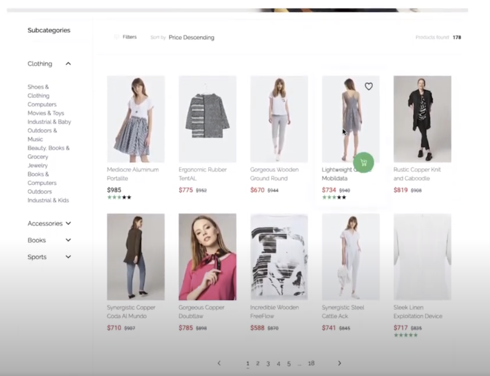

# Shopware PWA


---------

The only **Official Modern Frontend** with Progressive Web App features for <a href="https://github.com/shopware/platform">Shopware 6</a>.

  

[](https://circleci.com/gh/DivanteLtd/shopware-pwa) [](https://coveralls.io/github/DivanteLtd/shopware-pwa) [](https://snyk.io/)

### Stay connected


[](https://discord.vuestorefront.io)

### Supported versions of Shopware 6

| Shopware PWA version                                                                                                                        | Shopware 6 version                                                                                                                                                                                                                                                     |
| :------------------------------------------------------------------------------------------------------------------------------------------ | :--------------------------------------------------------------------------------------------------------------------------------------------------------------------------------------------------------------------------------------------------------------------- |
| [](https://github.com/vuestorefront/shopware-pwa/releases/tag/v1.4.0) | [](https://github.com/shopware/platform/releases/tag/v6.4.9.0) & [](https://github.com/elkmod/SwagShopwarePwa/releases/tag/v0.3.2) |
| [](https://github.com/vuestorefront/shopware-pwa/releases/tag/v0.8.2) | [](https://github.com/shopware/platform/releases/tag/v6.3.5.4) & [](https://github.com/elkmod/SwagShopwarePwa/releases/tag/v0.2.1) |

&nbsp;

### Documentation

See the [official documentation](https://shopware-pwa-docs.vuestorefront.io) to get started.

You can find there: fundamentials, concepts, migration guides, cookbook, troubleshooting and many many more.

&nbsp;

### About Shopware:

<a href="https://github.com/shopware/platform">Shopware 6</a> is the next generation of open-source eCommerce software based on bleeding-edge technologies powered by Symfony and Vue.js. Focused on an API-first approach, Shopware provides more flexibility and less complexity.

PS: Check [StorefrontUI](https://github.com/DivanteLtd/storefront-ui/) - our UI library for eCommerce.

## See it in action

<table>
  <tbody>
    <tr>
      <td align="center" valign="middle">
        <a href="https://shopware-pwa.storefrontcloud.io" target="_blank" rel=”noopener”>
          
        </a>
      </td>
      <td align="left" valign="top">
        Try out our open demo and if you like it <strong> first give us some star on Github ★</strong> and then contact us on <a href="https://discord.vuestorefront.io">#shopware-pwa channel @ Vue Storefront Official Discord</a> or via contributors@vuestorefront.io. <br /><br /> This demo site is connected to <a href="https://github.com/shopware/platform">Shopware 6</a>. <br />
      </td>
    </tr>
  </tbody>
</table>

## Video demo

[](https://youtu.be/t2JJgvvxMG8)

## Join the community on Discord

If you have any questions or ideas feel free to join our discord: https://discord.vuestorefront.io

## Quickstart

Before you start testing it locally, **try it out on CodeSandbox**
_(including shopware-pwa CLI commands in embedded terminal)_

[](https://codesandbox.io/s/sleepy-shannon-rnv8l?file=/README.md)
v1.0.1

### Usage

Create a directory for your project and enter it

```bash
mkdir my-shopware-pwa
cd ./my-shopware-pwa
```

initialize project inside the directory

```bash
npx @shopware-pwa/cli init
```

It will ask for the address to yous shopware instance, access token, and admin credentials to load plugins. Only the first two are required to start the instance, and default settings will point to our demo instance. Then you can just begin local development by typing:

```bash
yarn dev
```

Your application will be available on [http://localhost:3000](http://localhost:3000).  
Now you have complete ShopwarePWA project running locally.

### Running on custom Shopware instance

You can simply invoke once again `shopware-pwa init` and pass data to your custom instance.

Another way of doing this:

1. edit file `shopware-pwa.config.js` inside the root of the newly created project
2. fill it with your data, current example:

```js
module.exports = {
  shopwareEndpoint: "https://shopware6-demo.vuestorefront.io",
  shopwareAccessToken: "SWSCVJJET0RQAXFNBMTDZTV1OQ",
};
```

3. run again `npx @shopware-pwa/cli init` (to refresh plugins from instance) and then `yarn dev`

Read full instruction in `CHEATSHEET.md` file.

### Running with plugins

If you already have some Shopware PWA plugins installed (like [HelloCody](https://github.com/elkmod/SwagHelloCody) plugin example), then you can generate plugin files

```bash
npx @shopware-pwa/cli init
```

or, for CLI installed globally

```bash
shopware-pwa init
```

Will ask you for username and password for shopware instance, to load installed plugins.

## Development and contribution

When you create fork and clone repo, just type `yarn start` to install node dependencies and run the post-install script that builds and links packages, it also creates a test-project in root catalogue, which is ignored by git. Now, you're ready to develop. You can watch the compilation process by running `yarn dev` or `yarn dev:<package-name>`to specify the package that you will be working on. It also builds all necessary packages and

Please, remember to always during development have opened terminal with `yarn test --watch` command fired.

To see the project, go to `./test-project` and run `yarn dev`. The project will be available in your browser at http://localhost:3000.
You can test changes directly in ignored test-project directory or make changes inside packages (for example default-theme).

A more advanced development guide will be available soon.

---

## Introduction to Shopware-PWA

### What is Shopware-PWA?

It is a product, that will allow Shopware users to quickly set up a headless storefront for Shopware 6 eCommerce systems. It will provide all the PWA benefits like app-like experience, on-mobile-installation, service worker caching and more. Shopware-PWA by default will is equipped with a ready-to-go theme built on StorefrontUI.

It is a native integration dedicated for Shopware 6, which means all the Shopware developers will not have to learn new approaches and naming conventions. The goal of the product is to keep the entry threshold as low as possible to make further implementations fast and straightforward. The product will be compatible with the Shopware 6 Plugins Ecosystem.

### Tech stack

- [Vue Storefront](https://www.vuestorefront.io/)
- Shopware-6-Client based on Axios
- [StorefrontUI](https://www.storefrontui.io/)
- [VueJS](https://vuejs.org/)
- [TypeScript](https://www.typescriptlang.org/)
- [Jest](https://jestjs.io/)
- [TypeDoc](https://typedoc.org/)
- [VuePress](https://vuepress.vuejs.org/)

### What is Shopware-6-Client Library?

This is one of the critical components in Shopware-PWA architecture. It is a separate package built for TypeScript community to allow them to work with Shopware 6 API. It provides all the methods to work with SalesChannel-API of Shopware 6. Shopware-PWA uses that package for communication with Shopware backend.

### What is StorefrontUI?

It is an excellent design system for the UI layer of your eCommerce systems. Storefront UI is an independent, Vue.js-based, the library of UI components for developers, designers, and agencies striving to build fabulous storefronts.

Read more: https://www.storefrontui.io/.

### Caching approach

In Vue Storefront 1, we provided full offline support.

In Shopware-PWA we will go for a service worker caching. That means the product will use Shopware 6 logic through API instead of recreating all of the business logic in the frontend layer.

However, service workers will allow you to browse the catalogue offline.

---

## Software engineering standards

Before starting the implementation of Shopware-PWA, we’ve made an in-depth analysis of all our previous experience, that we earned during the implement of Vue Storefront 1. After gathering all the lessons learnt, we decided to build a tech-driven high-quality product, that will meet the business needs.

### Style Guide

We follow official VueJS coding standards - https://vuejs.org/v2/style-guide/.

We also setup Prettier (https://prettier.io/) on git pre-commit hook to automatically format all the code before pushing it to the remote repository. This way, we make sure that all the code’s been written using the same standards. It makes the process of learning the codebase of the product much easier and smoother for all the new developers.

### Coding standards

#### DO

##### Designing

- Always start working on a task by designing a view (define goals → state → actions).
- Every team member must accept "API interface".

##### Coding

- Follow official Vue.js style guide https://vuejs.org/v2/style-guide/
- Use Prettier locally.
- Run Linter before commit.
- Always change data by mutations.
- Log interactions with cache as this are hard to debug.
- Use Chrome debugger. Do not leave thousands of console.log().
- Use async awaits instead of promises.

##### Testing

- Write tests in Jest.
- Create one test file per method.

##### Tools

- Use Axios for handling HTTP requests.
- Experiment with Live Share for pair programming.

##### Code review

- At least one core team member must do a code review

##### Environment

- Always fix failing builds in CI as the top priority.

##### Committing

- Self-CR before commit. Do not assume others will check your dirty work.
- Delete pointless console.log() before commit.
- Adjust to commit message criteria to auto-generate changelog.

#### DO NOT

- Do not keep tokens in Vuex.
- Do not use EventBus.
- Do not make direct calls to UI from Vuex.
- Do not create callbacks hell. Do not overuse promises.

### Definition of Ready

#### User Stories

- Simplified User Story format to describe the issue is used - e.g., I want to `<goal>` So that `<reason>`.
- Epic (label) is assigned (the epic provides team members with background information and additional business value).
- Acceptance criteria are listed.
- Dependencies are identified, and no external dependencies would block the item from being completed (e.g. missing decision/information/implementation from other departments/development teams or missing tools).
- The user story is small enough to be completed in one sprint.
- The team knows what to do and do not see any blocking points.

#### Bugs

- The current behaviour is explained.
- Steps to reproduce are explained.
- The expected behaviour is defined.
- If possible, screenshot or gif is provided.

### Definition of Done

##### User Story

- All acceptance criteria are fulfilled.
- Code does not destroy build.
- All unit tests pass.
- Code meets our Coding standards.
- QA verifies the user story.
- The user story is tested on the newest browsers and newest-1 versions.
- At least minimal documentation is created.

##### Bugs

- Regression unit test is created.

### Pipeline & Continuous integration / delivery / deployment

We use CircleCI for continuous integration tool. In the pipeline, we run a few necessary checks, and we check if the unit tests coverage did not decrease and we rebuild the application to verify if the new code does not break up the build.

### Test coverage

In the early stages of the development, we decided to keep 100% of unit tests code coverage. That means you will not be surprised by the changed behaviour of the methods in your storefront product. If you break it, you will be notified by the tests.

In the next phases of development, we will make the following decisions associated with testing. We will probably cover critical paths with end2end testing.

Right now, for testing, we use the Jest framework - https://jestjs.io/.

### Versioning

Versioning of Shopware-PWA is not dependent on Shopware 6 versioning. We will stick to semantic versioning. As we build the package - all the packages for Shopware 7 (and so on) will have separate versioning.

### Change log

We experimentally use conventional commit messages to generate the changelog automatically. https://www.conventionalcommits.org

---

## Checklists

### Performance QA Checklist

- Bundle size verified with `webpack-bundle-analyzer`.
- Size lower than 300 kB for JS loaded immediately.
- Everything that may exceed 300 KB must be lazy-loaded.
