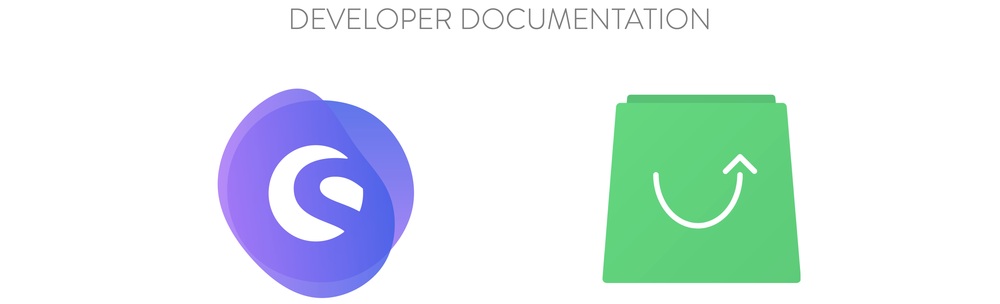

<center>

**🚀 Quickstart** or [learn more](/landing/getting-started/)

</center>

```bash
npx @shopware-pwa/cli init 		# Initialize project
yarn dev 						# start dev server
```

<center>
The v0.9.x of shopware-pwa is also available to play on at:

[](https://codesandbox.io/s/shopware-pwa-v09x-gp02u?file=/README.md)

</center>

---

<div class="flex-container">

<div class="md-50">

### [Project](/landing/project/)

Understand the goal and scope of this project

### [Getting started](/landing/getting-started/)

Quickstart and finding your way around

### [Fundamentals](/landing/fundamentals/)

Get to understand the core components of the application

### [Cookbook](/landing/cookbook/)

See how to work with the project in specific cases

- [FAQ & Troubleshooting](/landing/resources/troubleshooting/)

</div>

<div class="md-50">
	
### [Concepts](/landing/concepts/)
Guides for functional concepts like CMS or Checkout

### [Operations](/landing/operations) <Badge text="new" type="info"/>

Best practices, release notes, [migration guides](/landing/operations/migrations/), guidelines for setup, hosting and deployment

### [Resources](/landing/resources/)

Roadmap, Package API references and related projects

- [Composables API docs](/landing/resources/api/composables/)
- [Shopware 6 API client](/landing/resources/api/shopware-6-client/)

</div>

</div>

<center style="margin-top: 100px;">

Made with ❤️ by shopware AG & Vue Storefront

</center>

<style>
.flex-container {
	display: block;
	margin-top: 25px;
}

.preview-image {
	width: 50%;
}

@media screen and (min-width: 720px) {
	.flex-container {
		display: flex;
	}

	.md-50 {
		width: 50%;
	}
}
</style>
