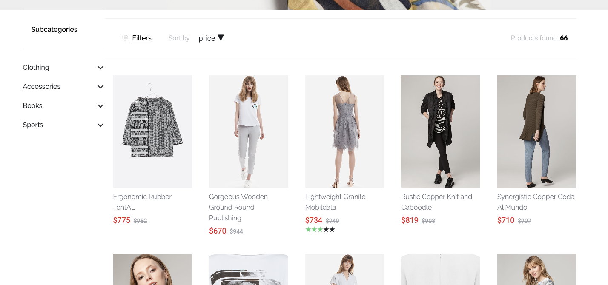

# Implementing CMS components

## CMS components structure

The structure is placed inside `cms` directory, and has `cmsMap.json` file inside and 3 subfolders:

- elements
- blocks
- slots

Playing with CMSes, you can see that in some cases components are not implemented


The message always contains a type of component, so you already know that `block` here is missing. We're not yet sure if should we add a new block or use the existing one. Let's go with that first and for `category-navigation` add config using already existing block.

in `cmsMap.json` at the default-theme package, we're adding a new entry with an already existing block `CmsBlockDefault`

``` json{9}
{
  "sections": {
    "default": "CmsSectionDefault",
    "sidebar": "CmsSectionSidebar"
  },
  "blocks": {
    "text-on-image": "CmsBlockTextOnImage",
    "sidebar-filter": "CmsBlockDefault",
    "category-navigation": "CmsBlockDefault"
  },
  "elements": {
    "product-box": "CmsElementProductCard",
    "product-slider": "CmsElementProductSlider",
    "image": "CmsElementImage"
  }
}
```

and we see the result:



As we can see, our block should have some margins inside it. As we shouldn't modify `CmsBlockDefault` for that, because it may break other blocks, we create an individual block for `category-navigation`.

## Creating new CMS component

New CMS component should be placed in specific cms directory. As an example, we're creating a new block for type `category-navigation`. 

Block component name should start with `CmsBlock`. In our case, it will be `CmsBlockCategoryNavigation`.

CMS component should contain:

- root CSS class with a similar name to our component, in our example `cms-block-category-navigation`
- component name property - same as file name
- prop `content` with type Object and default property
- computed values to easily display section/block/slot needs

We should use generic components to display children:

- in block components, we use `CmsGenericElement`
- in section components, we use `CmsGenericBlock`

so our example block component now looks like this

```vue
<template>
  <CmsGenericElement
    v-if="getContent"
    :content="getContent"
    class="cms-block-category-navigation"
  />
</template>

<script>
import CmsGenericElement from 'sw-cms/CmsGenericElement'

export default {
  components: {
    CmsGenericElement,
  },
  name: 'CmsBlockCategoryNavigation',
  props: {
    content: {
      type: Object,
      default: () => ({}),
    },
  },
  computed: {
    getSlots() {
      return this.content.slots || []
    },
    getContent() {
      return this.getSlots.length && this.getSlots[0]
    },
  },
}
</script>

<style lang="scss" scoped>
@import '../settings.scss';

.cms-block-category-navigation {
  @include desktop-size;
}
</style>

```

and we're changing the mapping in `cmsMap.json` to a new component in `blocks` section

``` json{9}
{
  "sections": {
    "default": "CmsSectionDefault",
    "sidebar": "CmsSectionSidebar"
  },
  "blocks": {
    "text-on-image": "CmsBlockTextOnImage",
    "sidebar-filter": "CmsBlockDefault",
    "category-navigation": "CmsBlockCategoryNavigation"
  },
  "elements": {
    "product-box": "CmsElementProductCard",
    "product-slider": "CmsElementProductSlider",
    "image": "CmsElementImage"
  }
}
```

The display is the same, but we can now modify it safely without affecting other CMS blocks.

So we want to add some top margins to correct our problem - in the desktop sidebar is too high.

So we're changing the styles:

```vue{7-9}
<style lang="scss" scoped>
@import '../settings.scss';

.cms-block-category-navigation {
  @include desktop-size;

  @include for-desktop {
    margin-top: 20px;
  }
}
</style>
```

and then we have our desired effect:


And that's it. Set of these rules apply for sections, blocks and elements. And are applicable in themes, plugins and your project!

You can read more about how to create custom CMS elements in shopware:

- [https://docs.shopware.com/en/shopware-platform-dev-en/how-to/custom-cms-block](https://docs.shopware.com/en/shopware-platform-dev-en/how-to/custom-cms-block)
- [https://docs.shopware.com/en/shopware-platform-dev-en/how-to/custom-cms-element](https://docs.shopware.com/en/shopware-platform-dev-en/how-to/custom-cms-element)