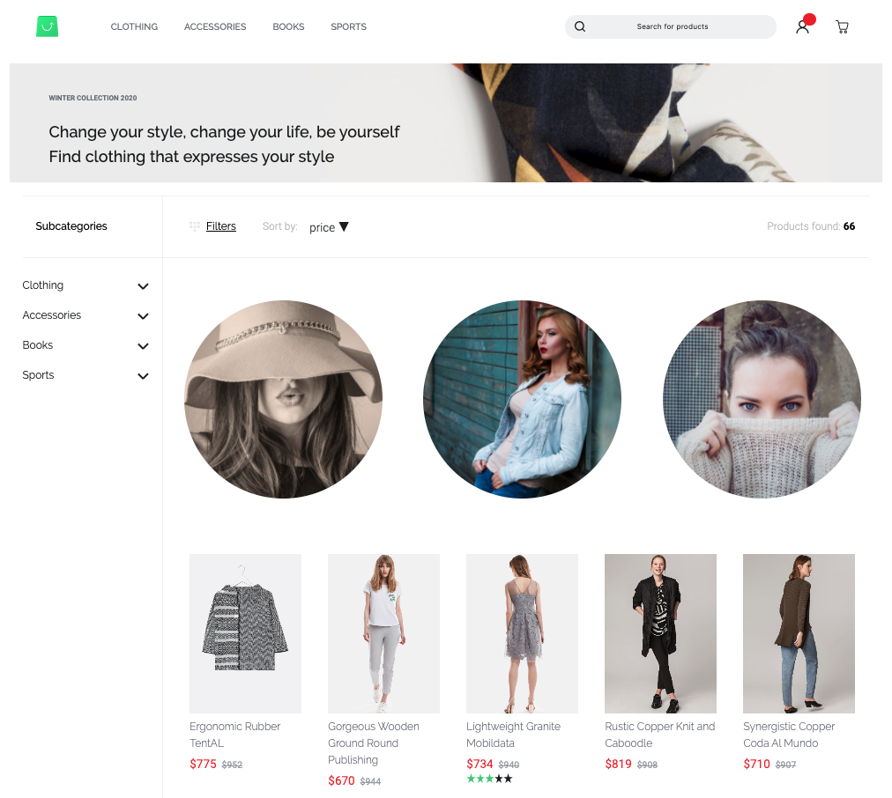
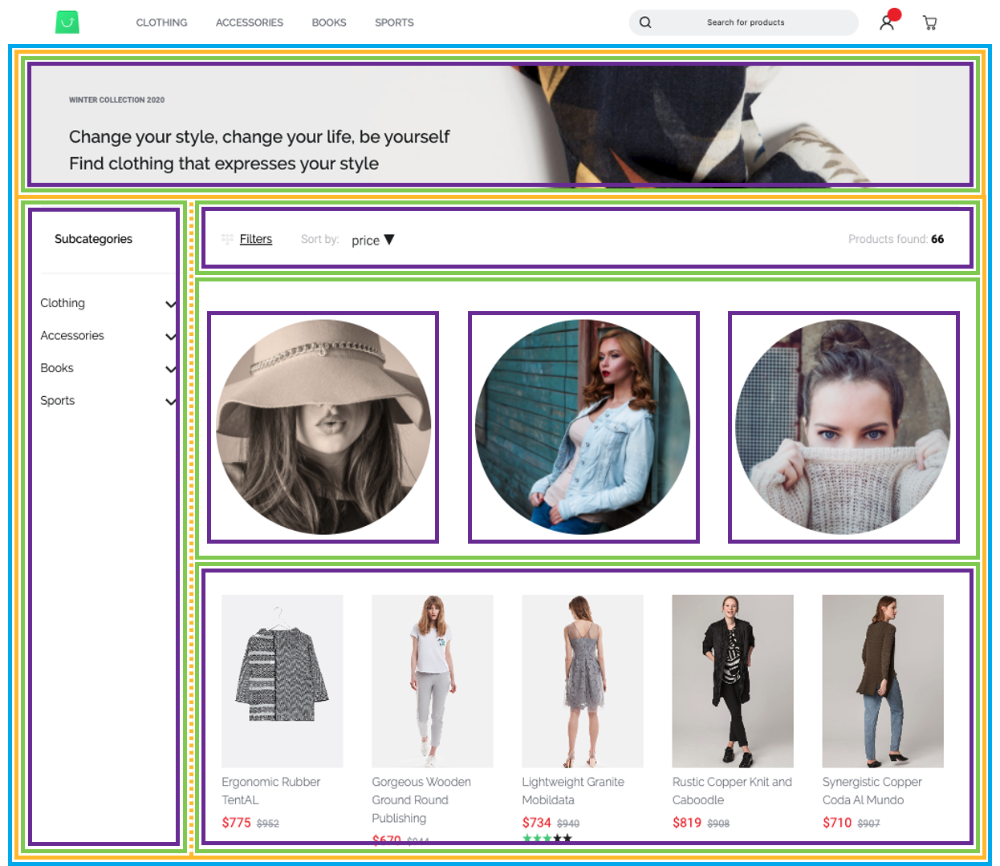
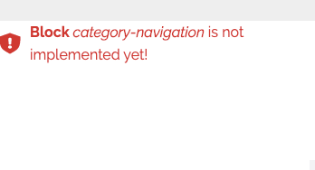
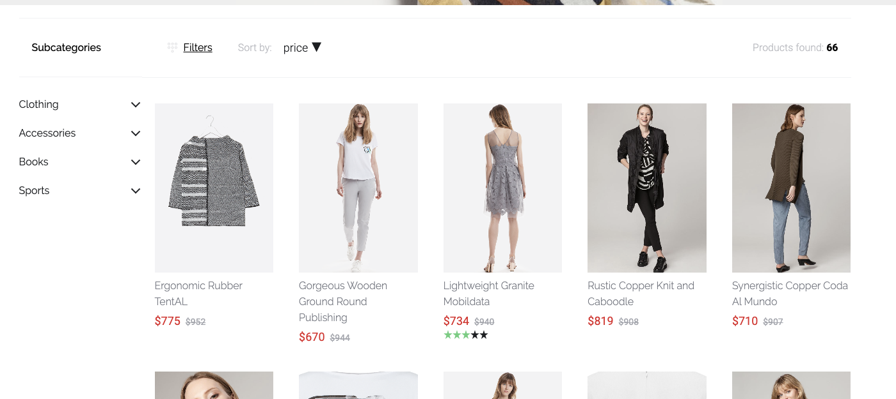

# Shopping Experiences (CMS)

::: tip
This documentation does not explain how to create custom pages that contain static content or use non-cms related endpoints. You can follow the Nuxt.js documentation on [pages](https://nuxtjs.org/guide/views/#pages) as Shopware PWA is a Nuxt.js project.
:::

[[toc]]

## Intro

This is a guide to Shopware CMS and how it translates to Shopware PWA.

After reading the full guide, you will understand how

- CMS pages are organised in Shopware
- the PWA resolves the page layout from an API response
- to add custom blocks to extend the layout or make contributions

In this guide I will assume you have a general knowledge of

- Content management in Shopware 6 using [Shopping Experiences (Shopware Docs)](https://docs.shopware.com/en/shopware-6-en/content/ShoppingExperiences)
- Setting up shopware-pwa ([Cheatsheet](/landing/resources/cheatsheet.html))

## Structure

So let's start easy, by taking a look at the page structure as returned from the `/store-api/pwa/page` endpoint which is provided by the **SwagShopwarePwa** plugin. The snippet below doesn't resemble the exact response, it rather illustrates its structure.

```js
{
  cmsPage: {
  	sections: [{
  		blocks: [{
  			slots: [{
  				slot: "content",
  				type: "product-listing",
  				...
  			}]
  		}, ...]
  	}, ...]
  }
}
```

It is a tree where the root node is a page. Each page can have multiple sections. Each section can contain multiple blocks. Each block can have zero or more slots where each slot contains exactly one element. Easy as that.

Let's go through these structural components step by step, before we discuss the structure based on this page:



We do this in a top-down manner, starting from the biggest element or the _tree root_:

### Page

A page serves as a wrapper and contains all content information as well as a `type` which denotes whether it serves as a

- Category / Listing page
- Shop page
- Static page
- Product page <Badge text="from v0.9" type="info"/>

### Section

Defines a horizontal container segment within your page which can be either:

- Two-Columns which we refer to as `sidebar` and `content` or
- A single column

A section contains blocks which are usually stacked upon each other.

### Block

A block represent a unit spanning an entire row which can provide custom layout and stylings. For UI purposes blocks are clustered into categories such as:

- Text
- Images
- Commerce
- Video

Each block can contain none up to multiple **slots**. A slot has a name and is just a container for one element. To be more clear, I will use an example - take the following block:

```js {2,4}
block: {
	type: "text-hero",
	slots: [{
		type: "text",
		slot: "content",
		config: {
			content: {
				source: "static",
				value: "Hello World"
			}
		},
	}]
}
```

Pretty clear what this will look like - we will have a hero block, containing the text "Hello World". But having `type: "text-hero"` and `"type": "text"` in this nested structure might feel somewhat redundant you might think - of course there will be a text shown.

Let's take a step back and look at another example:

```js {2,4}
block: {
	type: "text-hero",
	slots: [{
		type: "image",
		slot: "content",
		config: {
			media: {
				source: "static",
				value: "ebc314b11cb74c2080f6f27f005e9c1d"
			}
		},
		data: {
			media: {
				url: "https://my-shop-host.com/media/ab/cd/ef/image.jpg"
			}
		}
	}]
}
```

Well, now we still have the `text-hero` block but suddenly it contains an image. That is due to the internal structure of our CMS and the generic purpose of blocks. The **slots** defined by a block are abstract. In the examples shown above, the text-hero block only contains one slot, named `content`.

### Elements

Elements are the "primitives" in our tree hierarchical of structural components. Elements have no knowledge of their context and usually just contain very little markup. Ultimately and most importantly, elements are rendered inside the slots of their "parent" blocks.

Types of elements comprise

- text
- image
- product-listing
- video

### Wrap-up

Now that we have a proper understanding of all the components involved, we can look at the page shown before. I've used color coding to highlight the different types of components.

- **Page** blue
- **Section** yellow (_opposed to the horizontal one, the dotted vertical line indicates the column separation, not a separate section_)
- **Block** green
- **Element** purple



## Implementation and Extension

After that introduction we can start finding our way around `shopware-pwa`. After you have initialized a new project using the `npx @shopware-pwa/cli init` command, you will find a directory named `/cms` in your root. This will be your working area for the custom cms components (or the ones you override). Let's put that aside at the beginning and take a look into the internals to help us understand the process.

:::warning NOTE
The CMS implementation as well as the extension mechanism for it is part of the default-theme implementation. If you are creating a custom theme from scratch, be aware that you won't be able to use the mechanics described below.
:::

### Code Structure

> If you want to skip the internals, [go to "Custom components"](#custom-components)

First, we switch into the default theme that comes with Shopware PWA.

```sh
cd node_modules/@shopware-pwa/packages/default-theme
```

If you are familiar with Nuxt.js you will probably recognize directories like `/pages`, `/components` or `/assets`. These files serve as a blueprint for your theme.

There is one directory named `/cms`. The internal structure of that directory is closely resembles the structure followed in the Shopware core. Sections, blocks and elements are located in their resepective directories and you will have an easy time understanding it if you know Shopware and its CMS. Take a look into the different directories to get familiar with the structure.

::: tip MENTAL GLUE
Naming convention dictates the `cms/[section|element|block]/[component-type].vue` scheme for all CMS components.
:::

### Resolving

Remember the API response when requesting a CMS page on the [`store-api/pwa/page`](#block) endpoint from further above? It provides a `type` parameter for every section, block and element like `"text-hero"` or `"product-listing"`. Now we need to translate this to our components. It's no more than a mapping in the `cmsMap.json` file within your `cms` directory. The CMS resolving will take care of the rest.

:::details cmsMap.json

```json
{
  "sections": {
    "default": "CmsSectionDefault",
    "sidebar": "CmsSectionSidebar"
  },
  "blocks": {
    "text-on-image": "CmsBlockTextOnImage",
    "sidebar-filter": "CmsBlockDefault",
    "product-listing": "CmsBlockDefault",
    "image-text": "CmsBlockTextOnImage",
    "image": "CmsBlockDefault",
    "image-cover": "CmsBlockImageCover",
    "category-navigation": "CmsBlockCategoryNavigation",
    "image-bubble-row": "CmsBlockImageBubbleRow"
  },
  "elements": {
    "product-box": "CmsElementProductCard",
    "product-slider": "CmsElementProductSlider",
    "image": "CmsElementImage",
    "text": "CmsElementText",
    "vimeo-video": "CmsElementVideoVimeo",
    "youtube-video": "CmsElementVideoYoutube",
    "product-listing": "CmsElementProductListing",
    "category-navigation": "CmsElementCategoryNavigation",
    "sidebar-filter": "CmsElementCategorySidebarFilter"
  }
}
```

:::

Before we move on, we have to understand how we resolve the configuration (more specifically, the content of each block) internally. We will take the `image-bubble-row` as an example. An image bubble row contains three slots named `left`, `right` and `center`. The available slots have been defined in the Shopware Administration implementation of each block.

::: details How do I tell which slots my block contains?
The "single source of truth" for block and element configurations (i.e. their slots and defaults) are based on their respective Shopware Administration implementations.

For a reference, you can take a look at [this example showing such an implementation](https://github.com/shopware/platform/blob/master/src/Administration/Resources/app/administration/src/module/sw-cms/blocks/image/image-bubble-row/index.js) or the documentation on adding [custom elements](https://docs.shopware.com/en/shopware-platform-dev-en/how-to/custom-cms-element) and [custom blocks](https://docs.shopware.com/en/shopware-platform-dev-en/how-to/custom-cms-block) to Shopware.
:::

In the example below there is an image element rendered inside each slot:


The specific part of the API response that contains the `image-bubble-row` block will look similar to this:

```json {6,13,20}
{
  "type": "image-bubble-row",
  "slots": [
    {
      "type": "image",
      "slot": "center",
      "config": { ... },
      "fieldConfig": [ ... ],
      "data": { ... }
    },
    {
      "type": "image",
      "slot": "left",
      "config": { ... },
      "fieldConfig": [ ... ],
      "data": { ... }
    },
    {
      "type": "image",
      "slot": "right",
      "config": { ... },
      "fieldConfig": [ ... ],
      "data": { ... }
    }
  ]
}
```

You can see, that for every slot within the `image-bubble-block` there is one object provided. We refer to these objects as the **slot configuration**.

Each of these objects also contains a `type` field specifying the type of cms element yielded for that slot. By default there would be three images, but one could also be of `type: text`. It's totally up to the user to configure that and we have to be aware of that. A corresponding case could look like this:


For that reason, we introduced a generic element (namely `CmsGenericElement` in `cms/CmsGenericElement.vue`) which will resolve the correct element type and render it based on the configuration:

```vue
<template>
  <div class="cms-block-image-bubble-row">
    <CmsGenericElement
      :content="getLeftContent"
      class="cms-block-image-bubble-row__image"
    />
    <CmsGenericElement
      :content="getCenterContent"
      class="cms-block-image-bubble-row__image"
    />
    <CmsGenericElement
      :content="getRightContent"
      class="cms-block-image-bubble-row__image"
    />
  </div>
</template>
```

The identical pattern is applied to resolve the correct block types within cms sections and sections types within cms pages.

This will have us set up for our custom implementation.

## Custom components

In this section we will show you, how to create custom components and add them to the PWA. This applies to both, contributions as well as custom projects.

If you used the `showpare-pwa init` command to set up your project, you are probably working on a custom project, so the `cms` directory will be empty for you. If you checked out the `shopware-pwa` repository and initiated your test project using `yarn start`, you are ready to make core contributions and the `cms` directory will be located in `packages/default-theme/cms`.

### Adding the mapping

As described before, the structure is placed inside the `cms` directory, and has the `cmsMap.json` file inside as well as the three subdirectories:

- elements
- blocks
- slots

Playing with CMS pages in the PWA, you can see that in some cases components are not implemented. It will look like this:



The message always contains a type of component, so you already know that a `block` here is missing. We're not yet sure if should we add a new block or use the existing one. Let's go with that first and for `category-navigation` add config using already existing block.

:::details Why should I use an existing block despite PWA saying it's not implemented?
Some blocks actually contain remarkably little layout information. For example the blocks `image` and `product-listing` are really just containers for their respective elements. However, as soon as your block requires custom CSS or more markup, it is wise to create a custom block instead of using an existing one.

Remember - if you are reusing an existing block, your layout will change whenever the original block gets changed.

This tutorial will show both ways of doing it.
:::

In the `cmsMap.json`, we're adding a new entry with an already existing block `CmsBlockDefault`

```json{9}
{
  "sections": {
    "default": "CmsSectionDefault",
    "sidebar": "CmsSectionSidebar"
  },
  "blocks": {
    "text-on-image": "CmsBlockTextOnImage",
    "sidebar-filter": "CmsBlockDefault",
    "category-navigation": "CmsBlockDefault"
  },
  "elements": {
    "product-box": "CmsElementProductCard",
    "product-slider": "CmsElementProductSlider",
    "image": "CmsElementImage"
  }
}
```

and we see the result:


As we can see, our block should have some margins inside it to level it with the right blocks. As we shouldn't modify `CmsBlockDefault` for that, because it may break other blocks, we create an individual block for `category-navigation`.

### Creating the component

New CMS components should be placed in their specific cms directory. As an example, we're creating a new block for type `category-navigation` which should be placed in `cms/blocks`.

The block component name should start with `CmsBlock`. In our case, it will be `CmsBlockCategoryNavigation`.

It should contain:

- Root CSS class with a similar name to our component, in our example `cms-block-category-navigation`
- Component name property - same as file name
- prop `content` with type Object and default property
- Computed values to easily display section/block/slot needs

We should use generic components ([as described above](#resolving)) to display children:

- in block components, we use `CmsGenericElement`
- in section components, we use `CmsGenericBlock`

So our example block component file `CmsBlockCategoryNavigation.vue` now looks like this

```vue
<template>
  <CmsGenericElement
    v-if="getContent"
    :content="getContent"
    class="cms-block-category-navigation"
  />
</template>

<script>
import CmsGenericElement from "sw-cms/CmsGenericElement";

export default {
  components: {
    CmsGenericElement,
  },
  name: "CmsBlockCategoryNavigation",
  props: {
    content: {
      type: Object,
      default: () => ({}),
    },
  },
  computed: {
    getSlots() {
      return this.content.slots || [];
    },
    getContent() {
      return this.getSlots.length && this.getSlots[0];
    },
  },
};
</script>

<style lang="scss" scoped>
@import "../settings.scss";

.cms-block-category-navigation {
  @include desktop-size;
}
</style>
```

and we're changing the mapping in `cmsMap.json` to a new component in `blocks` section

```json{9}
{
  "sections": {
    "default": "CmsSectionDefault",
    "sidebar": "CmsSectionSidebar"
  },
  "blocks": {
    "text-on-image": "CmsBlockTextOnImage",
    "sidebar-filter": "CmsBlockDefault",
    "category-navigation": "CmsBlockCategoryNavigation"
  },
  "elements": {
    "product-box": "CmsElementProductCard",
    "product-slider": "CmsElementProductSlider",
    "image": "CmsElementImage"
  }
}
```

It looks same, but we can now modify it safely without affecting other CMS blocks.

So we want to add some top margins to correct our problem - on desktop, the sidebar is too high.

So we're changing the styles:

```vue{7-9}
<style lang="scss" scoped>
@import "../settings.scss";

.cms-block-category-navigation {
  @include desktop-size;

  @include for-desktop {
    margin-top: 20px;
  }
}
</style>
```

Finally we have our desired effect:



And that's it. This set of rules applies for sections, blocks and elements.

## Performance

The Shopware6 API returns all data that you may need, and even more. This is why an `includes` parameter was invented - [Read more at _Includes_ chapter here](https://docs.shopware.com/en/shopware-platform-dev-en/admin-api-guide/reading-entities).

In order to make the response payload smaller, aligned with our needs - the `includes` parameter is being used.

The list of all fetched fields within the page resolver, which is responsible for getting the CMS content (but not only) can be found [here (_getPageIncludes_ method)](../../../packages/composables/src/internalHelpers/includesParameter.ts). Thanks to this mechanism - the shopware-pwa fetches only the relevant data.
