# Plugins

(Shopware-pwa) plugins can be used to provide content to slots, or provide additional layouts or pages.

Plugins can be provided from the connected Shopware instance or can be provided locally from inside the PWA.

`npx @shopware-pwa/cli init` will take the resources from each **Shopware** plugin `[plugin]/src/Resources/app/pwa` directory in your connected Shopware instance and copy it to your **PWA** project. Plugin installation date determines whether it's "on top" of other plugins (newest installation date means that plugin is on top if there are more than one plugin injected to theme slot)

## Creating plugin

Plugin development can be easily made locally inside the PWA too. If we want to provide content to a slot, we first need to choose where would we want to plug it into. To see all available plugin slots we may want to select `yes` during `npx @shopware-pwa/cli init` command when it asks to allow dev mode.

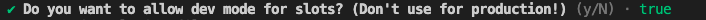

It shows then a button in the footer, which allows us to turn on Dev mode, and see all plugin slots in theme.

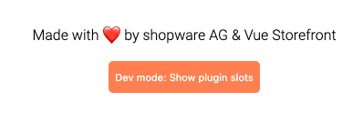

it will show us available slots on the theme, and you can click on any of them to see its name in the console

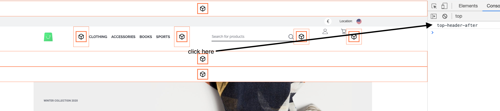

## Local plugin

Let's create `cool-promotion-plugin`, which can display our special product under the top header.
We're creating following files inside your project.

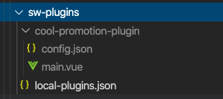

```
.
├── sw-plugins                  <- Local folder for developing and overriding plugins
│   ├── local-plugins.json      <- Config file to manage the order of plugins
│   ├── cool-promotion-plugin   <- your local plugin directory, maybe more of them
│   │   ├── config.json         <- plugin configuration
│   │   └── *.vue               <- vue files for your plugin
│   ├── another-local-plugin
│   │   ├── config.json
│   │   └── *.vue
```

so in `local-plugins.json` we're activating our new plugin

```json
{
  "cool-promotion-plugin": true
}
```

::: details In depth of `local-plugin.json`
This file allows us to set if plugin is active or not (`true/false`). Plugins importance rule is the same as for the plugins from shopware instance - latest installed is always on top of specific slot. Same in this file, latest key is the most important one.
:::

inside `cool-promotion-plugin/config.json` we need to put

- slot, in which we want to inject
- vue file, which should be displayed there

In the single plugin, we may inject in multiple plugin slots. Let's inject our `main.vue` file into `top-header-after` slot.

```json{4,5}
{
  "slots": [
    {
      "name": "top-header-after",
      "file": "main.vue"
    }
  ],
  "settings": {}
}
```

so our `main.vue` file can be as simple as

```vue
<template>
  <div class="cool-promotion-plugin">
    <h3>Hello from plugin!</h3>
  </div>
</template>
<script>
export default {
  name: "CoolPromotionPlugin",
  data() {
    return {};
  },
};
</script>
<style lang="scss" scoped>
.cool-promotion-plugin {
  display: flex;
  justify-content: center;
  border: 1px solid green;
}
</style>
```

we run `shopware-pwa plugins`, and we see the effect


Let's put some logic there, and we're getting the cheapest product and displaying it with link.

```vue
<template>
  <div class="cool-promotion-plugin">
    <!-- we can link to our product product -->
    <nuxt-link
      :to="getProductLink"
      v-if="product"
      class="cool-promotion-plugin__link"
    >
      <h3>{{ getName }} in special price! {{ filterPrice(getPrice) }}</h3>
    </nuxt-link>
  </div>
</template>
<script>
import { getProducts } from "@shopware-pwa/shopware-6-client";
import {
  getProductName,
  getProductRegularPrice,
  getProductUrl,
} from "@shopware-pwa/helpers";
import { ref, onMounted, computed } from "@vue/composition-api";
import { usePriceFilter } from "@/logic/usePriceFilter.js";

export default {
  name: "CoolPromotionPlugin",
  setup() {
    const product = ref(null);

    onMounted(async () => {
      // let's get the cheapest product
      const productsResult = await getProducts({
        sort: {
          field: "price",
          desc: false,
        },
        pagination: {
          limit: 1,
        },
      });
      product.value = productsResult.data[0];
    });

    const getName = computed(() => getProductName({ product: product.value }));
    const getProductLink = computed(() => getProductUrl(product.value));
    const getPrice = computed(() =>
      getProductRegularPrice({ product: product.value })
    );

    return {
      product,
      getName,
      getProductLink,
      getPrice,
      filterPrice: usePriceFilter(),
    };
  },
};
</script>
<style lang="scss" scoped>
.cool-promotion-plugin {
  display: flex;
  justify-content: center;
  border: 1px solid green;

  &__link {
    padding: 20px 5px;
    min-height: 30px;
    margin-right: 2rem;
  }
}
</style>
```

so we achieved this:

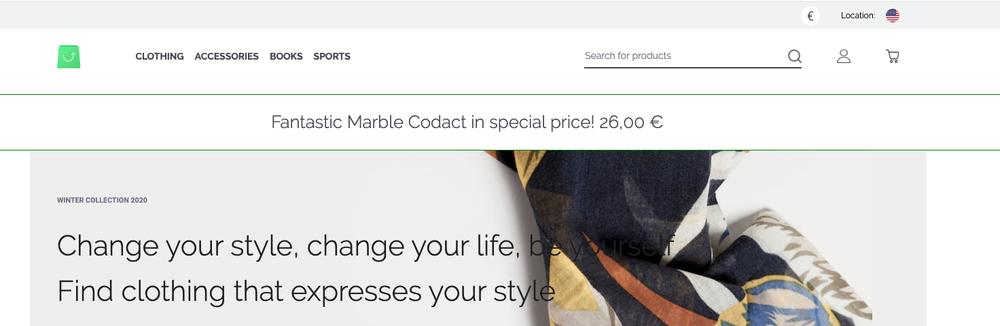

## Nesting plugins

Okay, but what if we have two or more plugins for our `top-header-after` slot?
Always the newest installed plugin in shopware instance is on top. But local plugins are over them. The easiest way is to picture that. On shopware instance, we have our HelloCody plugin, which displays random quotes. It injects into `top-header-after` slot as well. So we overrode that.

:::warning Always provide a slot for other plugins
We should always provide slots for other plugins; otherwise, we're blocking slot only for our plugin.
:::

Okay, so how we can allow other plugins to display as well if we're in `top-header-after`? We're providing Vue's default slot in our component, as simple as that:

```vue {11}
<template>
  <div class="cool-promotion-plugin">
    <!-- we can link to our product product -->
    <nuxt-link
      :to="getProductLink"
      v-if="product"
      class="cool-promotion-plugin__link"
    >
      <h3>{{ getName }} in special price! {{ getPrice }}</h3>
    </nuxt-link>
    <slot />
  </div>
</template>
```

So this allows our installed plugin to show up and present itself.

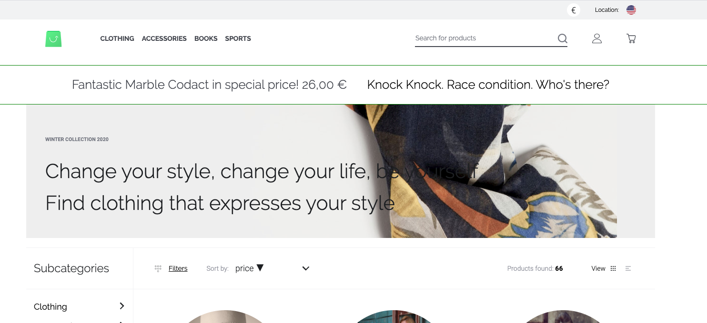

In this case, it shows a random plugin but it could be as well another promotion plugin. You always decide where to show slot with another plugin if exists. There are a lot more use cases. Like social login button - you're doing plugin for Facebook, but others may do plugins for Google, GitHub etc.

## Add pages and layouts in plugin <Badge text="from v0.9" type="info"/>

Adding custom pages and layouts is very similar to injecting into the project slot. Under the hood, it uses the same mechanism.

:::warning Important!
Custom plugins and pages will be added **only** if the theme and project don't have them. You **cannot** overwrite existing layouts and pages through the plugin.
:::

first, we'll create new layout, let's call it `myCustomLayout.vue`, it can look like this:

```vue
<template>
  <div>
    <h1>Hey! This is layout from the plugin.</h1>
    <nuxt />
  </div>
</template>

<script>
export default {
  name: "MyCoolCustomLayout",
  setup(props, { root }) {
    return {};
  },
};
</script>
```

now, we can create a new page, let's call it `myCustomPage.vue`. It should read the `id` param from the URL and display it. We plan to add this page under: `/our-custom-route/_id` path.

:::tip Tip
In order to create advanced pages read [Nuxt docs](https://nuxtjs.org/docs/2.x/directory-structure/pages) about pages and dynamic pages.

**REMEMBER**: The plugin page is not the same component as the Nuxt page. You don't have access to asyncData hook. You can set layout via config (see below) and do everything through `setup` method, so there should not be any missing features here for you.
:::

```vue
<template>
  <div>
    <p>Custom PLUGIN page with route id: {{ id }}</p>
    <nuxt />
  </div>
</template>

<script>
import { computed } from "@vue/composition-api";

export default {
  name: "MyPluginSuperPage",
  setup(props, { root }) {
    const id = computed(() => root.$route.params.id);

    return { id };
  },
};
</script>
```

so now we just need to add our new creations to our plugin's `config.json` file:

```json {8-15}
{
  "slots": [
    {
      "name": "top-header-after",
      "file": "myLocalPlugin.vue"
    }
  ],
  "layouts": [{ "name": "myCoolLayout", "file": "myCustomLayout.vue" }],
  "pages": [
    {
      "path": "our-custom-route/_id",
      "file": "myCustomPage.vue",
      "layout": "myCoolLayout" // that's how can use our custom layout, you can skip this field to use default theme layout
    }
  ],
  "settings": {}
}
```

so now, visiting `/our-custom-route/magic-id` you should see:

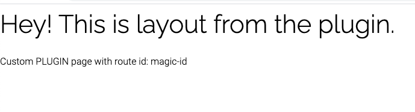

## Checkout plugins validation (payment, shipping) <Badge text="from v0.9" type="info"/>

When you're developing a payment or shipping plugin and you need custom validation - we got you!

Since the very cool validation library called [vuelidate](https://vuelidate.js.org/) is used, our life is simpler.
Several built-in validaton rules are at hand, and writing a custom rule should not be a big deal as well (see how to do it [here](https://vuelidate-next.netlify.app/custom_validators.html)).

So let's say we want to enable the "Cash on delivery" method only when the customer is over 18 years old.

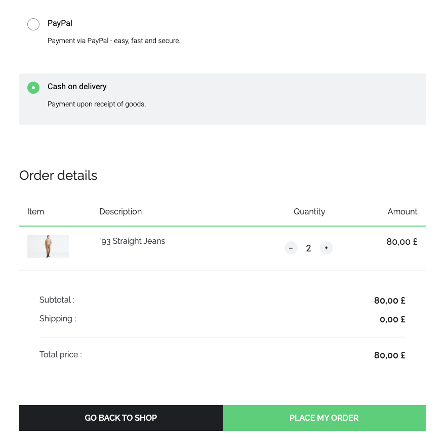

The first thing we need to know is a Plugin slot name, where we want to inject our component. We can see in Vue devtools when is the slot name for this specific payment method:
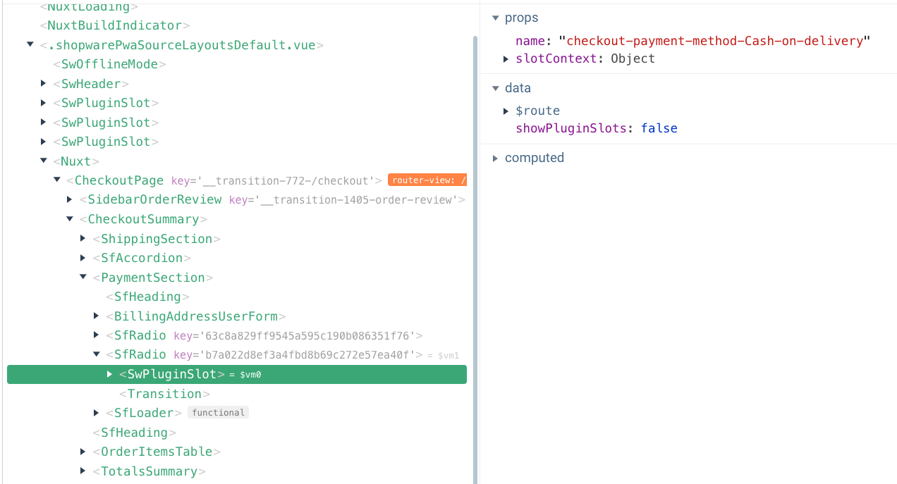
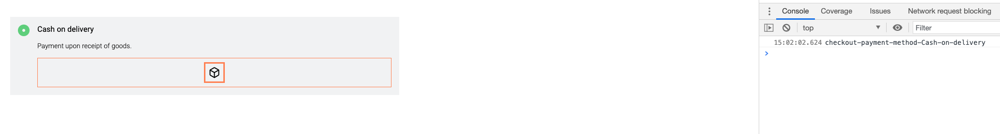

so now we know that we want to inject our plugin in the `checkout-payment-method-Cash-on-delivery` slot.
For simplification, we'll do it in our local plugin. Let's enable our example local plugin - change `sw-plugins/local-plugins.json` file to

```json
{
  "my-local-plugin": true
}
```

now let's go into this plugin config, and we can declare slot component (`sw-plugins/my-local-plugin/config.json`):

```json{7-10}
{
  "slots": [
    {
      "name": "top-header-after",
      "file": "myLocalPlugin.vue"
    },
    {
      "name": "checkout-payment-method-Cash-on-delivery",
      "file": "myCashOnDelivery.vue"
    }
  ],
  "settings": {}
}
```

and we need to create a Vue component (`sw-plugins/my-local-plugin/myCashOnDelivery.vue`):

```vue
<template>
  <div>
    <p>{{ $t("To use this payment method you must be over 18.") }}</p>
  </div>
</template>
<script>
export default {
  name: "myCashOnDelivery",
};
</script>
```

so now we have information displayed with payment method:
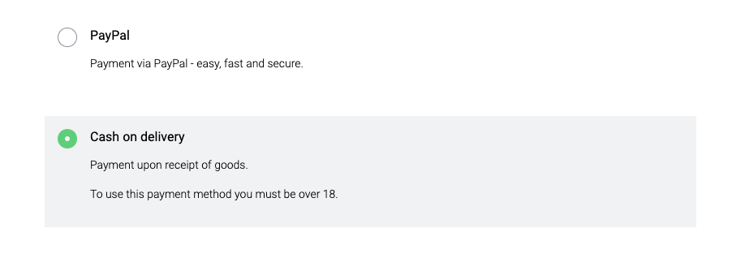

so now, let's edit our `sw-plugins/my-local-plugin/myCashOnDelivery.vue` and add validation logic:

```vue
<template>
  <div>
    <p>{{ $t("To use this payment method you must be over 18.") }}</p>
    <SwCheckbox
      v-model="isOverEighteen"
      name="isOverEighteen"
      :label="$t('I am over 18 years old.')"
      :valid="!$v.isOverEighteen.$error"
      :error-message="getErrorMessage"
    />
  </div>
</template>
<script>
import SwCheckbox from "@/components/atoms/SwCheckbox.vue";
import { useVuelidate } from "@vuelidate/core";
import { helpers } from "@vuelidate/validators";

export default {
  name: "myCashOnDelivery",
  components: {
    SwCheckbox,
  },
  data() {
    return {
      isOverEighteen: false,
    };
  },
  setup() {
    return {
      $v: useVuelidate(),
    };
  },
  computed: {
    getErrorMessage() {
      return this.$v.isOverEighteen.$errors?.length
        ? this.$v.isOverEighteen.$errors[0].$message
        : "";
    },
  },
  validations: {
    isOverEighteen: {
      mustBeCool: {
        $validator: (value) => value === true,
        $message: "You must be over 18 to pay with Cash on delivery",
      },
    },
  },
};
</script>
```

The validation message should be very clear. As it will also be displayed with Checkout error messages. "This field is required" may be confusing.

So now we have:
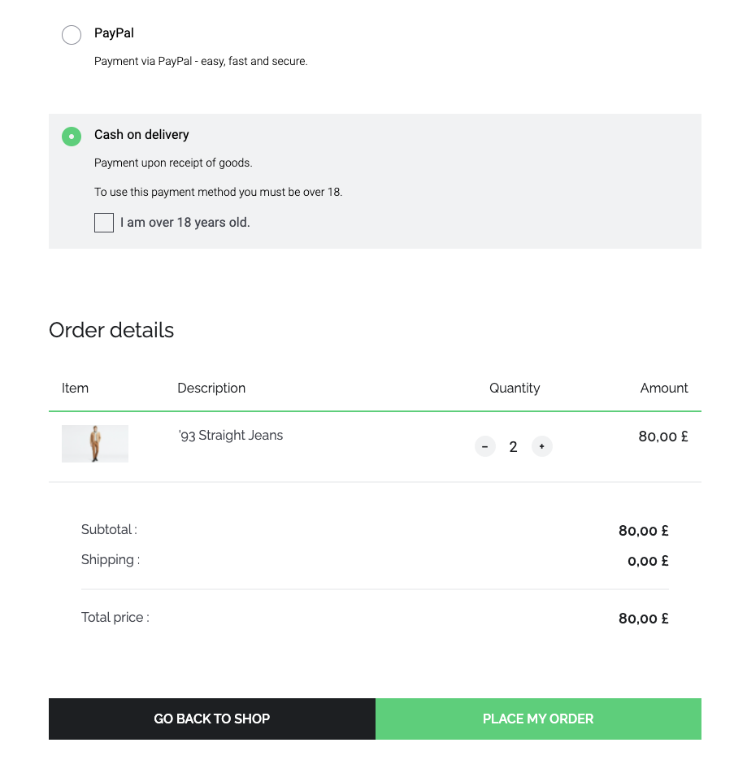

and after "Place my order" click:


