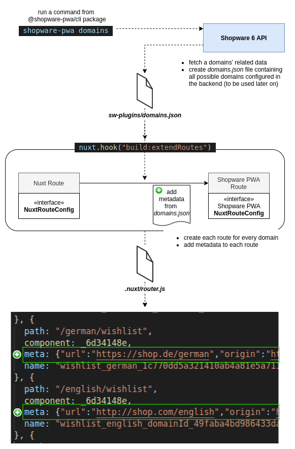

# Routing

The routing system is strongly based on Vue's & Nuxt's one.
The difference is, the Shopware PWA resolves routes also based on Shopware 6 routing itself.

## Enrichment process

The ordinary Nuxt routing is being enriched during the building step. The enrichment process relies on adding additional metadata to each route, received from synchronised domains config (`shopware-pwa domains` command).

The prepared `domains.json` file and the metadata for each route can be read and used in further actions, described below.

## Routing plugin

The plugin is accessible under `$routing` key, within Nuxt context. It provides an interfaces to read and set the basic information about the route and domain configuration, what explains an interface presented below.

### What the plugin does
1. Injects `$routing` object to manage and check the current domain configuration in entire application (for instance, `useDomains` within Language switcher).
2. Sets the current domain configuration by checking the current request (SSR) or when the origin gets changed.
3. Provides the middleware which:
    - Gets the domain data (`currencyId`, `locale`, `languageId`) from route's metadata (See enrichment process) or matching domain for current route from list of all available domains (`$routing.availableDomains`).
    - Sets the language for api-client (`$shopwareApiInstance.update({ languageId })`)
    - Sets the current currency (`useSessionContext.setCurrency`)
    - Sets the locale within `i18n` plugin (`app.i18n.locale = languageLocaleCode`)

Thanks to this process, the application is aware of the language and currency the customer is using at the moment.

## Production setup

If Shopware PWA application runs over a proxy (reverse proxy, load balancer, etc.) there is additional configuration required in order to tell Shopware PWA which domain (host) should be resolved. 

To do so, provide [X-Forwarded-Host](https://developer.mozilla.org/en-US/docs/Web/HTTP/Headers/X-Forwarded-Host) header containing appropriate host (appearing between a proxy and Shopware PWA).