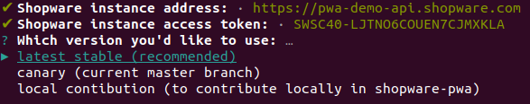
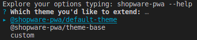
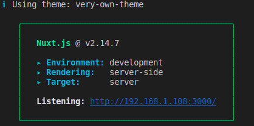

# Cookbook

> This content **is not** intended for contribution purposes.

## Table of contents

1. [How to init a project for my ecommerce _(not a contribution)_](#no1)
2. [Can I build a docker image with shopware-pwa inside?](#no2)
3. [How to change the Shopware6 API credentials](#no3)
4. [How to upgrade an existing project](#no4)
5. [How to customize or extend default shopware-pwa look](#no5)
   - [I want to add a new tab in product details page](#no51)
   - [I want to add additional page, like `/instagram` to show some posts](#no52)
   - [I want to write my own plugin to disable the "Add to cart notifications" feature.](#no53)
6. [How to use/write your own theme](#no6)
7. [How to install and register a nuxt plugin](#no7)
8. [How to add another language](#no8)
9. [Overwrite API defaults](#no9)

---

## 1. How to init a project for my ecommerce <a id="no1"></a>

> Prepare your Shopware6 instance, first. To do so, check required steps [here](../../guide/CHEATSHEET.md) _(Shopware setup paragraph)_.

1. Being in empty directory, run `npx @shopware-pwa/cli@canary init`
2. Answer a few basic questions:

   

3. That's it! Now you have a nuxt project with shopware-pwa installed.
   > You can work with the project in development mode: `yarn dev`, or when it's ready for production: `yarn build` to generate the production build.

## 2. Can I build a docker image with shopware-pwa inside? <a id="no2"></a>

1. Init the project first, [see point #1](#no1)
2. Build the project with command `yarn build` _(it's important, because the Dockerfile does not build a nuxt project at all - copy the files only)_
3. Notice that there is a `Dockerfile` in the project's root directory
4. Now you can build a docker image, for instance: `docker build -t "shopware-pwa:1.0.0" . ` _(name your image freely, point the context to current directory ".")_
5. After the build is done, you can run the image wherever you like: `docker run -p80:3000 shopware-pwa:1.0.0`
6. The container has started the nuxt application, directs the traffic from port 80 to the 3000 inside the container.

## 3. How to change the Shopware6 API credentials <a id="no3"></a>

1. Edit `shopware-pwa.config.js` file, located in generated project's directory.

2. Adjust the `shopwareEndpoint` and `shopwareAccessToken` to your needs

```
module.exports = {
  shopwareEndpoint: 'http://localhost:8000',
  shopwareAccessToken: 'SWSCDM5YUNVUZ3ZRUHHBMGNVTG',
}
```

3. `yarn dev` or `yarn build` command will take the latest credentials of your config file.

## 4. How to upgrade an existing project <a id="no4"></a>

1. shopware-pwa is hidden under only one module named `@shopware-pwa/nuxt-module` with all its dependencies.
2. You can upgrade the `package.json` directly, or just init the project once again with `npx @shopware-pwa/cli@canary init` command.
3. After doing this, visit [Upgrade page](../getting-started/upgrade.md) for more information if there are some additional steps needed.

## 5. How to customize default shopware-pwa look <a id="no5"></a>

> It's better to know what's hidden over the CMS in Shopware 6: visit [Shopping Experiences](../concepts/cms.md) because category pages, product listings are made of it.

You can customize the default-theme by overriding the specific Vue components, or just changing the styling. In order to understand how id works, let's see what a project's structure looks like

```
src/ directory
.
├── assets
│   └── scss
│       ├── main.scss       - write your own styling
│       └── variables.scss  - control the general appearance by changing the predefined variables
├── components              - here go the components you need, overriden ones as well as the new one
│   └── SwAddress.vue       - here the overriden SwAddress component is located
├── layouts
├── middleware
├── pages
│                           - place a spacific pages here, override current ones
├── plugins                 - extend the project with a nuxt plugin
├── static
│   ├── favicon.ico
│   └── icon.png
└── store                   - for vuex purposes

```

In general, the generated project is a [Nuxtjs](https://nuxtjs.org/) project. This is why the structure is the same, and the behavior of nuxt is kept. Thanks to this you can customize the generated project as much as you want without losing the fancy features that nuxtjs provides.

**By default, everything you put into this structure can extend, or modify the _@shopware-pwa/default-theme_ [link to the package](https://www.npmjs.com/package/@shopware-pwa/default-theme).**

## The most popular use cases

1. I want to add a new tab in product details page. <a id="no51"></a>

   > See how to customize an existing Vue component using shopware-pwa CLI [here](../../guide/TROUBLESHOOTING.md#question-how-can-i-override-theme-component)

   - use `npx @shopware-pwa/cli@canary override` command
   - pick up the `/SwProductTabs.vue` component
   - the component is being copied from `@shopware-pwa/default-theme` package, and then placed in `src/components` ready to edit.
   - now your shopware-pwa project uses your local `SwProductTabs.vue` instead of the one from default-theme.

2. I want to add additional page, like `/instagram` that connects to the Shopware6 API to get and show some data <a id="no52"></a>

   - create `instagram.vue` file in `src/pages`
   - implement a template, a `<script></script>` block which can have some logic, and style block maybe
   - utilize the `invokeGet, invokePost...` from `@shopware-pwa/shopware-6-client` package or any library (like `axios`) to make some requests you need

   It may look like:

   ```javascript
   <template>
      <div class="sw-instagram">
        <div v-if="posts.length">
          <InstagramPost v-for="post in posts" :post="post" />
        </div>
        <div v-else>
          <span>no posts found</span>
        </div>
      </div>
   </template>

    <script>
    import { getApplicationContext } from "@shopware-pwa/composables"
    import { invokePost } from "@shopware-pwa/shopware-6-client"
    import { onMounted, ref } from "@vue/composition-api"

    export default {
      name: "SwInstagramPage",
      setup(props, { root }) {
        // get the configured api client
        const { apiInstance } = getApplicationContext(root, "SwInstagramPage")
        const posts = ref([]);

        onMounted(async () => {
          // make an API call to get the instagram posts through Shopware6 API
          // let's assume you have an appriopriate module installed and an endpoint exposed
          try {
            const postsResponse = await invokePost({
              limit: 10,
              hashtags: "#great #clothes"
              ...
            }, apiInstance) // if you provide the current apiInstance you will have set a proper credentials (current context token)

            if(postsResponse.data) {
              posts.value = postsResponse.data
            }
          } catch (error) {
            console.error("SwInstagramPage:onMounted", error);
          }
        })

        return {
          posts
        }
      }
    }
    </script>

    <style lang="scss" scoped>
    </style>


   ```

3. I want to write my own plugin to disable the "Add to cart notifications" feature.<a id="no53"></a>

   - create `disable-notification.js` file in `src/plugins` directory
   - the created file is treated like normal nuxt plugin with an access to current context

   the plugin may look like this:

   ```javascript
   import { useIntercept, INTERCEPTOR_KEYS } from "@shopware-pwa/composables";
   import { addToCartNotification } from "@shopware-pwa/default-theme/logic/notifications";

   export default ({ app }) => {
     // import a disconnect method from useIntercept composable
     const { disconnect } = useIntercept(app);
     // pass the interceptor key you want to change, and pass the function to be removed from event dispatcher
     disconnect(INTERCEPTOR_KEYS.ADD_TO_CART, addToCartNotification);
   };
   ```

   - once the plugin is created, you need to reload the nuxt app to have it working in the project

## 6. How to use/write your own theme <a id="no6"></a>

> shopware-pwa enables to provide a theme by providing its code-name in `shopware-pwa.config.js` file, under the `theme` property. The theme structure **MUST** be compatible with a nuxt project.

a sample config file _shopware-pwa.config.js_:

```javascript
module.exports = {
  shopwareEndpoint: "http://localhost:8000",
  shopwareAccessToken: "SWSCDM5YUNVUZ3ZRUHHBMGNVTG",
  theme: "very-own-theme",
};
```

### How a custom theme can be resolved by shopware-pwa:

1. shopware-pwa looks for the local directory with corresponding name, as same as the theme provided in `shopware-pwa.config.js` sample above. So `<PROJECT_ROOT_DIR>/very-own-theme` will be checked if the compatible theme (the nuxt structure) is located.

2. shopware-pwa tries to resolve the package from npm, located in your `node_modules`, so if you already have a theme installed via npm or yarn in project's directory, you are able to use it.

### How create a custom theme

1. Being in project's root directory use a CLI command to generate the theme: `npx @shopware-pwa/cli@canary create-theme`

   

2. Choose the theme you would like to extend
3. The theme is created under the directory with name (code) that you provided in 1. step
4. The `package.json` file contains the `baseTheme` value with the theme you extend. The files property contains only a `dist` directory (it's used during the build, and the files from dist are published as a package)

::: warning
Please remember that the custom theme should be built before any usage.
That means that before starting a nuxt application, the custom theme should be prepared by using:
`yarn dev` or `yarn build` - to be sure, please check if `dist/` directory isn't empty in your custom theme.
:::

#### There are two useful scripts as well:

1.  `yarn dev` - executes `shopware-pwa dev-theme`

    - watch for changes within custom theme's files, located in `src/` dir
    - copies the theme files into `dist/` subdir from: base theme (if any provided) and `src/` directory
    - thanks to this the package is always up to date and can be linked and used with HMR during the main project's build

2.  `yarn build` - executes `shopware-pwa build-theme`
    - copies the files from a pointed base theme and put it into the `dist/` copies the new files from `src/` and overwrite files in `dist/` if there are matching ones

### How to use a custom theme

1. Add an entry in `shopware-pwa.config.js` with the `theme` property
2. `yarn dev` or `yarn build` depending on your needs
3. The result of dev mode would be like this:

   

   > notice that there is a `Using theme` information above the Nuxt.js output - it points your custom theme now.

## How to install and register a nuxt plugin <a id="no7"></a>

The main project's config file is still a `nuxt.config.js`, so there is no problem to use it anyway.

Let's try to install a [Google Tag Manager for Nuxt.js](https://www.npmjs.com/package/@nuxtjs/gtm), here's what we need (copied from package's readme):

1. run `yarn add @nuxtjs/gtm` or `npm install @nuxtjs/gtm` inside the project
2. Add @nuxtjs/gtm to the _modules_ section of `nuxt.config.js`

```js
import extendNuxtConfig from "@shopware-pwa/nuxt-module/config";

export default extendNuxtConfig({
  modules: ["@nuxtjs/gtm"],
  gtm: {
    id: "GTM-XXXXXXX",
    enabled: true, // for dev
    debug: true, // for dev,
    pageTracking: true, // push route change event automatically
  },
});
```

3. Now the GTM module is enabled and ready to use

## How to add another language <a id="no8"></a>

::: tip
Before you start, [learn the details](../operations/migrations/0.6.x_to_0.7.x.md#domain-route-handling) regarding the mechanism itself.
:::

### Things that should be done in admin panel

1. In admin panel, go to _Sales Channel_ (used by PWA) > _Domains_ tab
2. Add domain. **It's important** that the URL should match the one used in your `shopware-pwa.config.js` under the `pwaHost`.

   Add a distinctive suffix pointing to language (or general config) you want to use. It may be `/de-DE`, `/en` or whatsoever like `/my/very/formal/english/site`, so the whole entry would be like:
   `https://my-shopware-pwa.com/my/very/formal/english/site`

3. Pick the other settings for your domain like language, currency.
4. Save the domain and the sales channel afterwards.

### Things that should be done in shopware-pwa app

1. Go to project's root directory.
2. Run `npx @shopware-pwa/cli@canary domains`.
3. Pass the credentials for your admin credentials.
4. In the end the _Shopware domains refreshed_ notice should be displayed.
5. the `.shopware-pwa/sw-plugins/domains.json` should contain the previously created.domain as an another entry.
6. Run a nuxt.js application again.

### FAQ

How to change the language switcher's label (visible in top navigation bar)?

- go to `.shopware-pwa/sw-plugins/domains.json` and edit a chosen `languageLabel` property.

## Overwrite API defaults <a id="no9"></a>

You can have full control over API defaults ued by composables.

First you need to add import inside `shopware-pwa.config.js` file.

```js
const defaultsConfigBuilder =
  require("@shopware-pwa/nuxt-module/api-defaults").default;
```

Now we could have many abilities to edit the config, I'll leave the API with examples

#### Adding new value

```js
// merge object (including arrays), in this case add one value to array
defaultsConfigBuilder().add("useCms.includes.cms_page_slot",  "someCustomValue")

// result for defaultsConfigBuilder().get("useCms.includes.cms_page_slot")
[
  'id',
  'type',
  'slot',
  'blockId',
  'config',
  'data',
  'backgroundMediaMode',
  'backgroundMedia',
  'someCustomValue',
]
```

#### Removing value

```js
// merge object (including arrays), in this case add one value to array
defaultsConfigBuilder().remove("useCms.includes.cms_page_slot",  "type")

// result for defaultsConfigBuilder().get("useCms.includes.cms_page_slot")
[
  'id',
  'slot',
  'blockId',
  'config',
  'data',
  'backgroundMediaMode',
  'backgroundMedia',
]
```

#### Replacing value

```js
defaultsConfigBuilder().replace("useCms.includes.cms_page_slot", [
  "id",
  "myValue",
]);
// another examples
defaultsConfigBuilder().replace("useCms", { limit: 3 }); // replace whole useCms setting
defaultsConfigBuilder().replace("useCms.limit", 5);
```

### Implementation details for some cases

- `add` would replace value if it's not an object or array, for example with `limit` property
- you could chain methods like `defaultsConfigBuilder().add(...).remove(...).add(...)`
