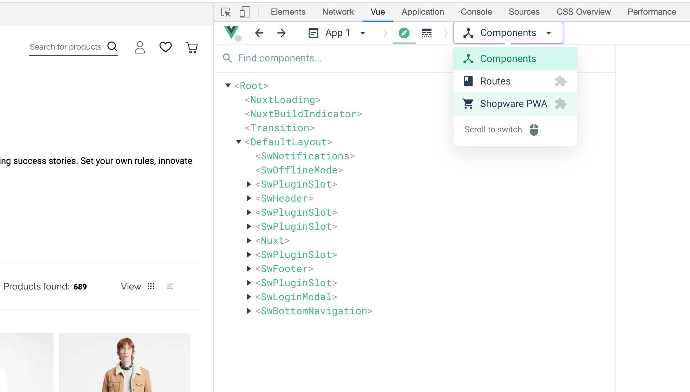
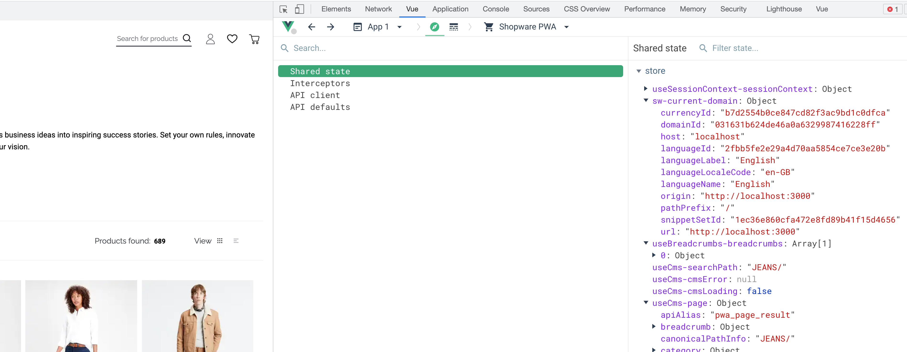
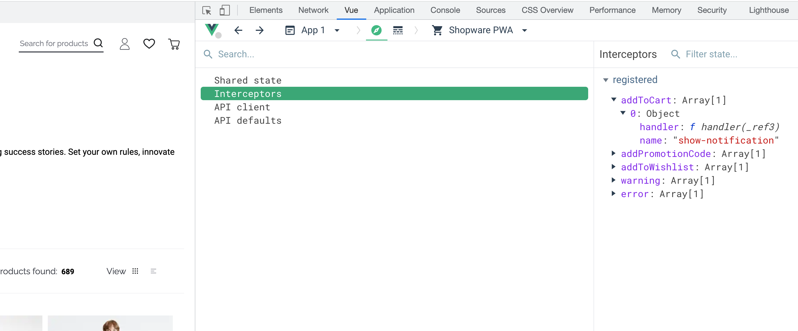
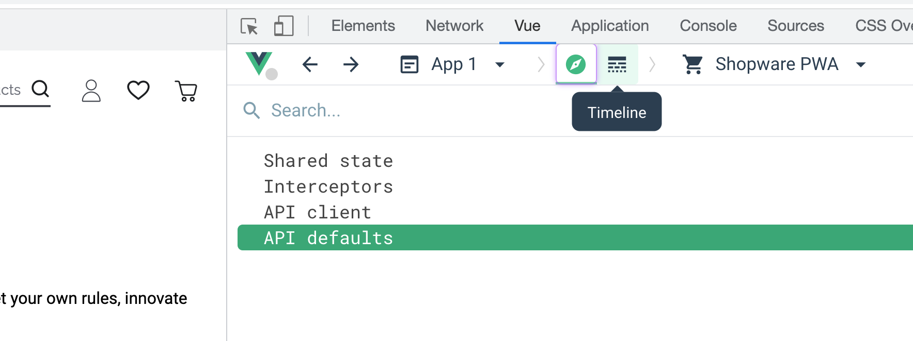
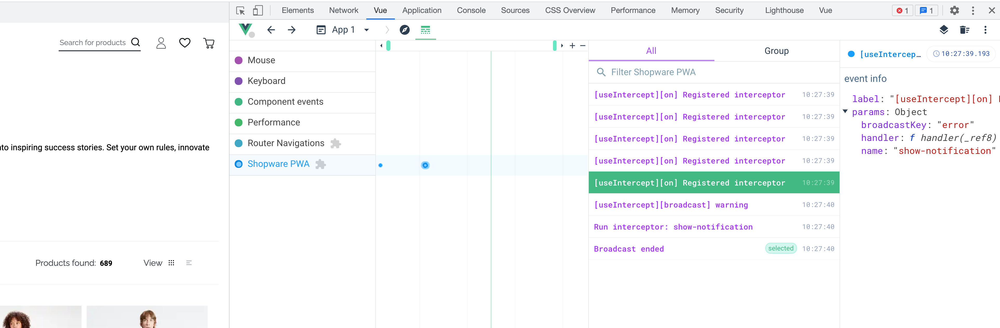
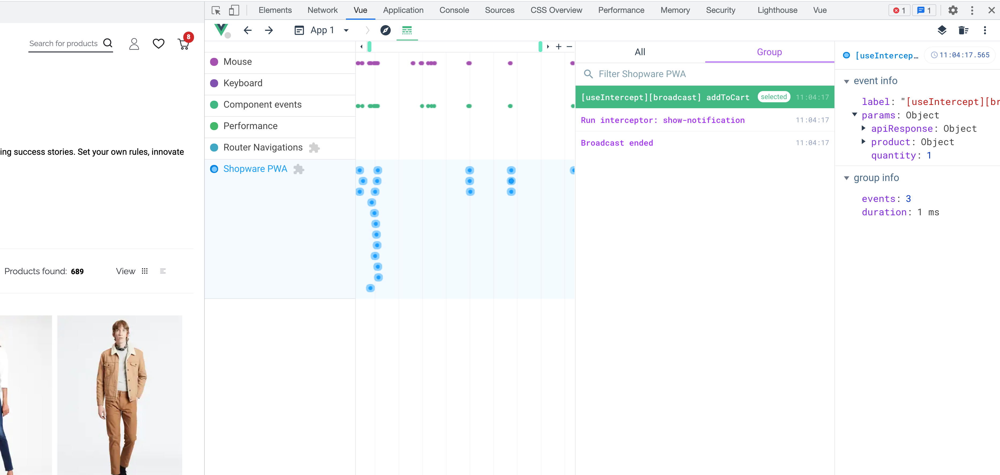
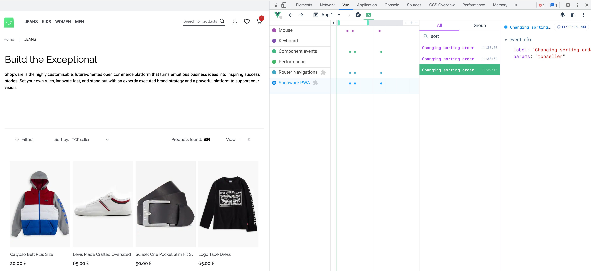
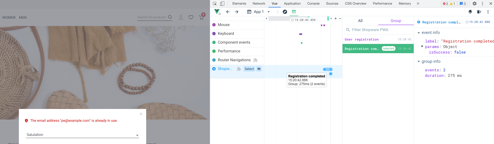

# Devtools <Badge text="from v1.0.0-RC.3" type="info"/>

We want to support your development process all the way. Tracking what's going on inside the application might be overwhelming. Let us help here.

## Install Vue Devtools

You can find the documentation for Vue Devtool [here](https://devtools.vuejs.org/). To be able to see what's inside the Shopware PWA you need to download the beta version of Vue Devtools (with Vue 3 support) [instalation guide](https://devtools.vuejs.org/guide/installation.html). Quicklinks:

- [Chrome](https://chrome.google.com/webstore/detail/vuejs-devtools/ljjemllljcmogpfapbkkighbhhppjdbg)
- [Firefox](https://devtools.vuejs.org/guide/installation.html#beta)

## Enable devtools

In development mode, devtools are enabled by default. We rely on the two env variables, so the devtools are enabled when:

- `NODE_ENV` is different that `production`
- or `ENABLE_DEVTOOLS` has w `true` value

You can set these values manually in your `.env` file inside the root directory

```env
ENABLE_DEVTOOLS=true
NODE_ENV=dev
```

If you have the Devtools installed, you can just start your project `yarn dev`, and inside your browser Devtools you should see something like this:



So what can you do with the devtools?

## Preview the Shared State

Every time you're using `sharedRef` from [useStaredState](/landing/resources/api/composables.usesharedstate.html) composable, then you can share your state within the entire application. Other Shopware composables are also using this. So with this option, you can dive into what's inside this state.



:::warning Important!
The keys of the shared state can change. You have an overview of the Application State, but when you rely directly on a specific key (for example `const cmsSearchPath = sharedRef('useCms-searchPath')`) mind this key is internal and can be changed.
:::

## Preview registered interceptors

You can see registered [interceptors](/landing/concepts/interceptor.html) with the proper description, so you can see which interceptors are invoked during specific events.



## API client settings and API defaults

You can also see what the current configuration of the [API client](landing/resources/api/shopware-6-client.clientsettings.html) is or what are [API defaults](/landing/cookbook/#overwrite-api-defaults) used by the Shopware PWA composables.

## Inspect the timeline

Vue devtools are providing the Timeline feature, and you can access it here:



We added the Shopware PWA layer to see related events.

### Track events

You can track the events, which appears in the timeline. Events often contain additional parameters (as JSON object) with useful data.



### Track group events

Some of the events are grouped. This way, you can see the time between first and last event log and filter related events. For example, a `broadcast` event from `useIntercept` composable is invoking all registered interceptors. You can track the invocations, and which invocation changed the payload.



## Add a custom devtools events

If you want to add some events to debug using devtools there's a way for that! We opened the API to add your custom logs inside the timeline.

:::warning Note
Custom events inside the devtools are in the experimental phase. The API of this feature might change a bit, but using them with optional chaining (for example `devtools?.log('something')`) will ensure the application stability.
:::

### Add timeline log, warning or error <Badge text="experimental" type="warning"/>

You can add a custom log to the devtools using one of the three methods:

```ts
function log(label: string, params: any): void;
function warning(label: string, params: any): void;
function error(label: string, params: any): void;
```

Example - we want to track sorting order changes

```ts
setup() {
  const {getCurrentSortingOrder, changeCurrentSortingOrder} = useListing({ listingType: 'categoryListing' })
  const { devtools } = getApplicationContext()


  const currentSortingOrder = computed({
    get: () => getCurrentSortingOrder.value,
    set: (order) => {
      devtools?.log('Changing sorting order', order)
      changeCurrentSortingOrder(order)
    },
  })
}
```

so now, every time you change the sort order on the category page, you can see:



### Add timeline event group

You can also group your timeline events to see how much time is needed for specific actions to complete and see the data flow inside.

Example - track the user registration process with the registration result, so we can change the `invokeRegister` method in `SwRegister` component.

```ts
setup() {
  const {register} = useUser()
  const { devtools } = getApplicationContext()


  async function invokeRegister() {
      $v.value.$reset()
      const isFormCorrect = await $v.value.$validate()
      if (!isFormCorrect) {
        return
      }
      const event = devtools?.trackEvent(
        "User registration",
        registrationFormData.value
      )
      const isSuccess = await register(registrationFormData.value)
      event?.log("Registration completed", { isSuccess })
      isSuccess && emit("success")
    }
}
```

This way, we see grouped events and the time this event took. Inside `group` tab, we can see all the logs connected to this event with passed parameters.


