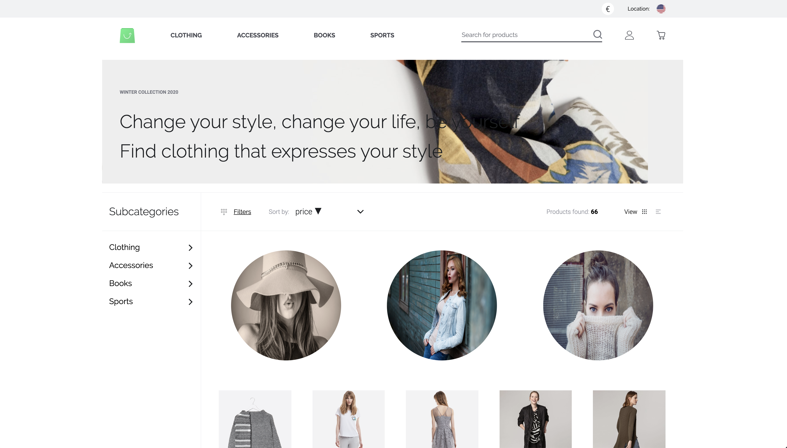

# Get started

This guide will help you get started with shopware-pwa.

[[toc]]

## Quickstart

Set up shopware-pwa in less than 10 minutes.

::: tip
If it's not enough, or you are not familiar with Shopware 6 or Nuxt based projects, please visit a dedicated [Installation guide](./installation.md) which lead you from backend to the frontend aspects of the installation.
:::

### Create project

Create a directory for your project and enter it

```bash
mkdir my-shopware-pwa
cd ./my-shopware-pwa
```

Initialize the project inside the directory by running

```bash
npx @shopware-pwa/cli init
```

It will ask for the address to your shopware instance, access token, and admin credentials to sync routing data or load plugins. Only the first two are required to start the instance, and default settings will point to our demo instance.

::: tip
Don't let this step throw you off. As you are starting the PWA, it requires a backend to get its products, content etc. By default, shopware-pwa init will connect you to a generic Shopware backend hosted by us. However, at this point you can already connect your custom shop instance.

Please read these instructions on [how to prepare your Shopware 6 instance](/landing/getting-started/prepare-shopware.html) to communicate with the PWA before running shopware-pwa init.
:::

Then you can just begin local development by typing:

```bash
yarn dev
```

After roughly 30 seconds, your application will be available locally on [http://localhost:3000](http://localhost:3000) looking similar to this:



### Create project with specific version

You can initialize a project with a specific version of shopware-pwa by passing the version in CLI invocation.

```bash
npx @shopware-pwa/cli init # latest stable version (recommended for production)

npx @shopware-pwa/cli@canary init # latest canary version (master branch) for development
npx @shopware-pwa/cli@0.9.2 init # specific choosen version
```

after the project is initialized you can invoke CLI commands by tying:

```bash
yarn shopware-pwa <command>
```

this will take the version, which is defined in your `package.json` file. When you'll upgrade the version in your `package.json` file, you can use the `yarn shopware-pwa init` command to update the project configuration.

### Configure the backend connection

Instead of using the interactive CLI to configure your backend connection, you can also define the parameters in a file

1. Edit the `shopware-pwa.config.js` file inside the root directory of your project
2. Fill it with the data from your instance ([how to prepare your Shopware 6 instance](./prepare-shopware))
3. Define allowed hosts to be used in your PWA instance

```js
module.exports = {
  shopwareEndpoint: "https://pwa-demo-api.shopware.com/trunk",
  shopwareAccessToken: "SWSCMDAZUUG5Z05VWKXIDWPSEQ",
  shopwareApiClient: {
    // optional, allow to override the default settings
    timeout: 5000, // timeout limit in ms
  },
  shopwareDomainsAllowList: [
    "http://localhost:3000",
    "http://localhost:3000/de",
    "https://pwa=shop.com",
  ],
};
```

4. Restart the PWA dev server (you might have to stop it before)

```bash
yarn dev
```

### shopware-pwa.config.js config file

Available settings inside the `shopware-pwa.config.js` file:

```ts
export interface ShopwarePwaConfigFile {
  /**
   * List of allowed domains that must be handled by PWA (multilanguage routing requires that config)
   * It's related to the Sales channel configuration.
   */
  shopwareDomainsAllowList?: string[];
  /**
   * default domain prefix
   */
  fallbackDomain?: string;
  /**
   * Shopware6 URL
   */
  shopwareEndpoint: string;
  /**
   * id specific for each sales channel
   */
  shopwareAccessToken: string;
  /**
   * theme code: npm package name or local one (directory name)
   */
  theme: string;
  /**
   * default locale used in application
   */
  defaultLanguageCode?: string;
  /**
   * {ShopwareApiClientConfig}
   */
  shopwareApiClient?: ShopwareApiClientConfig;
  /**
   * List of the plugins that are installed on Shopware instance but should not be loaded.
   */
  disabledPlugins?: string[];
}

export interface ShopwareApiClientConfig {
  /**
   * value of timeout limit for the requests (ms)
   */
  timeout?: number;
  /**
   * credentials for HTTP basic auth
   */
  auth?: {
    username: string;
    password: string;
  };
}
```

### How do I move on?

What about...

- Exploring the [directory structure](/landing/project/structure/) of the project.
- Go [troubleshooting](/landing/resources/troubleshooting/) if you encounter any issues
- [Reporting an issue](https://github.com/DivanteLtd/shopware-pwa/issues/new/choose) if you couldn't solve it

</center>
