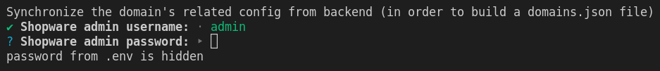

# Configuration

In this section, you will find information how to change the default _static_ configuration of your project (not a backend side).

Shopware PWA, as it's built upon a NuxtJS, provides many options of configuration in the Nuxtjs style, accepting a `nuxt.config.js` file entirely! 

Furthermore, the Shopware PWA part, which is delivered as a Nuxt module, also has its own config file named `shopware-pwa.config.js`. Both files are located in the root dir of a project.

----

## shopware-pwa.config.js

The configuration that is required by the [PWA nuxt-module](https://www.npmjs.com/package/@shopware-pwa/nuxt-module), which Shopware PWA is generally made of.

Let's see the config's interface:

```js
// packages/commons/src/defaultConfig.ts

export interface ShopwarePwaConfigFile {
  /**
   * list of allowed domains for this pwa instance from saleschannel configuration
   */
  shopwareDomainsAllowList?: string[];
  /**
   * default domain prefix
   */
  fallbackDomain?: string;
  /**
   * Shopware6 URL
   */
  shopwareEndpoint: string;
  /**
   * id specific for each sales channel
   */
  shopwareAccessToken: string;
  /**
   * theme code: npm package name or local one (directory name)
   */
  theme: string;
  /**
   * default locale used in application
   */
  defaultLanguageCode?: string;
  /**
   * {ShopwareApiClientConfig}
   */
  shopwareApiClient?: ShopwareApiClientConfig;
  /**
   * List of the plugins that are installed on Shopware instance but should not be loaded.
   */
  disabledPlugins?: string[];
}
```

### Basic setup

```js
// shopware-pwa.config.js
module.exports = {
  shopwareEndpoint: "https://shopware6-demo.vuestorefront.io",
  shopwareAccessToken: "SWSCVJJET0RQAXFNBMTDZTV1OQ",
  shopwareApiClient: {
    // optional, allow to override the default settings
    timeout: 5000, // timeout limit in ms
  },
  shopwareDomainsAllowList: ["http://localhost:3000", "http://localhost:3000/de", "https://pwa-shop.com"],
};
```


## nuxt.config.js

As default setup, you will probably not need to customize the origin `nuxt.config.js` file as it's described in the [Official Documentation](https://nuxtjs.org/docs/directory-structure/nuxt-config). The project has its own preconfigured nuxt configuration to work with PWA in the best setup. You can easily extend it by using `extendNuxtConfig` method (RECOMMENDED).


```js
// nuxt.config.js
import extendNuxtConfig from "@shopware-pwa/nuxt-module/config"

export default extendNuxtConfig({
  head: { // the title and meta sections of head area is using now values from this files.
    title: "Shopware PWA",
    meta: [{ hid: "description", name: "description", content: "" }],
  },
    // everything else is inherited
})
```


You can also provide the entire config on your own (but then, **don't forget to ensure what's required** in the base [Shopware PWA config](https://github.com/vuestorefront/shopware-pwa/blob/master/packages/nuxt-module/src/extendNuxtConfig.ts#L10) - it's NOT RECOMMENDED anyway, because doing this, you will loose compatibility with core api during further upgrades).

## API defaults

In progres...

Temporarly visit a dedicated [Cookbook's section](../cookbook/#_9-overwrite-api-defaults)

## Custom theme

In progress.

Temporarly visit a dedicated [Cookbook's section](../cookbook/#_6-how-to-use-write-your-own-theme).

## Routing

In progress.

Temporarly visit a dedicated [Routing concept](../concepts/routing), or [Cookbook's secion](../cookbook/#_8-how-to-add-another-language) describing parts of the concept.

## Environment variables

This guide will help you to configure your shopware-pwa project using [environment variables](https://en.wikipedia.org/wiki/Environment_variable).

### Usage

Environment variables can be used within the application in many places, in the runtime as same as the build time. In nodejs-based application they can be accessed by using `process.env.[VARIABLE_CODE]`, `process.env.NODE_ENV` for instance. Nuxt and shopware-pwa itself uses some predefined variables to customize the application.

The great example is a helper for getting images with optional image processor (treated like a proxy), the helper contains the piece of code:

```js
  if (!process.env.EXPERIMENTAL_IMAGE_PROCESSING_SERVER) return originalImageSrc

  ...

    let url = `${process.env.EXPERIMENTAL_IMAGE_PROCESSING_SERVER}?url=${mediaUrl}`

```

Shopware-pwa provides the optional way of setting env variables by using `.env` file, instead of setting them up using system environment variables explicitly like: 

`EXPERIMENTAL_IMAGE_PROCESSING_SERVER=https://someserver.com/img/ shopware-pwa dev` or even before running the nodejs process, manually.


### Setup

A generated project contains `.env.template` among other files placed in root directory. 

::: tip
Remember that the `.env` file is listed in `.gitignore` and shouldn't be versioned because it may contain some sensitive data.
:::


The `.env.template` file's content may look similar to this one:

```
HOST=0.0.0.0
PORT=3000
ADMIN_USER=admin
ADMIN_PASSWORD=shopware
ENABLE_DEVTOOLS=false
NODE_ENV=production
EXPERIMENTAL_IMAGE_PROCESSING_SERVER
```

**In order to activate the variables from the file, change the template's name to just `.env`**

### Description

The default environment variables

- `HOST` - nuxt server host name (`0.0.0.0` by default)
- `PORT` - nuxt server port number (`3000` by default)
- `ADMIN_USER` - Shopware 6 admin user name (`admin` by default) 
- `ADMIN_PASSWORD` - Shopware 6 admin password (`shopware` by default)
- `ENABLE_DEVTOOLS` - config turning on the nuxt dev tools (`true` by default)
- `NODE_ENV` - application mode: dev or production (`dev` by default)
- `EXPERIMENTAL_IMAGE_PROCESSING_SERVER` - URL to the custom image processor (well described [here](https://github.com/vuestorefront/shopware-pwa/blob/master/packages/default-theme/src/helpers/images/getResizedImage.js))

::: tip
shopware-pwa CLI tool can also detect the current state of environment variables and use given `ADMIN_USER` and `ADMIN_PASSWORD` values in `plugins` and `domains` commands (suggest credentials). 


:::