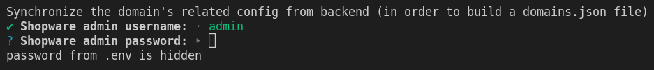

# Environment variables

This guide will help you to configure your shopware-pwa project using [environment variables](https://en.wikipedia.org/wiki/Environment_variable).

## Usage

Environment variables can be used within the application in many places, in the runtime as same as the build time. In nodejs-based application they can be accessed by using `process.env.[VARIABLE_CODE]`, `process.env.NODE_ENV` for instance. Nuxt and shopware-pwa itself uses some predefined variables to customize the application.

The great example is a helper for getting images with optional image processor (treated like a proxy), the helper contains the piece of code:

```js
  if (!process.env.EXPERIMENTAL_IMAGE_PROCESSING_SERVER) return originalImageSrc

  ...

    let url = `${process.env.EXPERIMENTAL_IMAGE_PROCESSING_SERVER}?url=${mediaUrl}`

```

Shopware-pwa provides the optional way of setting env variables by using `.env` file, instead of setting them up using system environment variables explicitly like:

`EXPERIMENTAL_IMAGE_PROCESSING_SERVER=https://someserver.com/img/ shopware-pwa dev` or even before running the nodejs process, manually.

## Setup

A generated project contains `.env.template` among other files placed in root directory.

::: tip
Remember that the `.env` file is listed in `.gitignore` and shouldn't be versioned because it may contain some sensitive data.
:::

The `.env.template` file's content may look similar to this one:

```
HOST=0.0.0.0
PORT=3000
ADMIN_USER=admin
ADMIN_PASSWORD=shopware
ENABLE_DEVTOOLS=false
NODE_ENV=production
EXPERIMENTAL_IMAGE_PROCESSING_SERVER
```

**In order to activate the variables from the file, change the template's name to just `.env`**

## Description

The default environment variables

- `HOST` - nuxt server host name (`0.0.0.0` by default)
- `PORT` - nuxt server port number (`3000` by default)
- `ADMIN_USER` - Shopware 6 admin user name (`admin` by default)
- `ADMIN_PASSWORD` - Shopware 6 admin password (`shopware` by default)
- `ENABLE_DEVTOOLS` - config turning on the nuxt dev tools (`true` by default)
- `NODE_ENV` - application mode: dev or production (`dev` by default)
- `EXPERIMENTAL_IMAGE_PROCESSING_SERVER` - URL to the custom image processor (well described [here](https://github.com/vuestorefront/shopware-pwa/blob/master/packages/default-theme/src/helpers/images/getResizedImage.js))

::: tip
shopware-pwa CLI tool can also detect the current state of environment variables and use given `ADMIN_USER` and `ADMIN_PASSWORD` values in `plugins` and `domains` commands (suggest credentials).


:::
