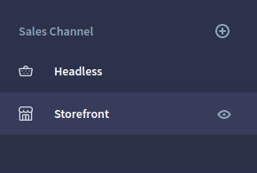
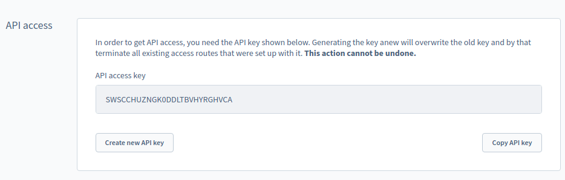

# Local environment

This section explains how to set up a local environment for development purposes.

## Default setup

Normally, we provide a default setup for contributors. It means that you don't need anything to install and setup except the shopware-pwa application installed locally.
shopware-pwa uses a public API that the core team manages, tailored to just work with the frontend application.

## Why to have it all locally?

There are many reasons why you may want to have a whole stack (shopware-pwa + shopware 6) locally. Most important are:

1. **Full control**

   Local instane can be updated anytime you want, as same as making changes in the settings through an admin panel - you can change many scenarios fast without help from people outside.

2. **Easy debugging**

   Having Shopware 6 instance locally gives you a direct access to the logs, files and other env specific settings that cannot be accessed from the admin panel.

3. **Shared instance is not affected**

   You can easily adjust the environment for your needs (for instance a different version of shopware 6) that can be temporary without disturbing a state of API for other users. The catalog inventory, draft CMS pages are also available only for your personal usage and nobody sees it.

## Shopware instance in 10 seconds\*

[Dockware.io](https://dockware.io/) comes with help to run your Shopware 6 (v5 is also available) on your local environment and that's not all. It provides ready-to-use [docker](https://docker.com) images that can be executed everywhere, even on the server.

There are 3 modes there:

- **play** _ready in 10 seconds\*_
- **dev** _in 3 minutes\*_
- **contribute** _in 5 minutes\*_

_\* it will take more if docker has to pull an image when it's not available locally._

Choose one depending on your needs. People from Dockware project take care of docker images' availability, but they are really up to date for every Shopware v6 release!

## Let's do it

Let's assume that you want to contribute a shopware-pwa project and you do have your reasons to work with a very own Shopware 6 instance.

### Installing Shopware 6 instance & shopware-pwa setup

1.  The only requirement for your system is to have a docker on your computer. Follow the [instructions](https://docs.dockware.io/setup/docker-setup).

2.  Create a `docker-compose.yml` file somewhere, containing following content:
    ````yml
    version: "3"
    services:
    shopware:
    image: dockware/play:latest
    container_name: shopware
    ports: - "80:80"
    networks: - web
        networks:
            web:
                external: false
        ```
        > NOTE: It's possible to use only one command and nothing more (`docker run --rm -p 80:80 dockware/play:latest
    `), but the storage for database and the code (including installed plugins) aren't persisted and **will disappear** when the container is stopped. More details for such option [here](https://docs.dockware.io/use-dockware/first-run).
    ````
3.  Run `docker-compose up` being where the file created in previous step is placed.

4.  After the docker container is executed, you will see the output of Dockware stack, like:

    ```
    shopware    | WOHOOO, dockware/dev:6.3.5.1 IS READY :) - let's get started
    shopware    | -----------------------------------------------------
    shopware    | DOCKWARE CHANGELOG: /var/www/CHANGELOG.md
    shopware    | PHP: PHP 7.4.15 (cli) (built: Feb  7 2021 12:21:51) ( NTS )
    shopware    | Apache DocRoot: /var/www/html/public
    shopware    | ADMINER URL: http://localhost/adminer.php
    shopware    | MAILCATCHER URL: http://localhost/mailcatcher
    shopware    | PIMPMYLOG URL: http://localhost/logs
    shopware    | SHOP URL: http://localhost
    shopware    | ADMIN URL: http://localhost/admin
    shopware    |
    shopware    | What's new in this version? see the changelog for further details
    shopware    | https://www.shopware.com/de/changelog/
    ```

    SHOP URL and ADMIN URL are already here, there is nothing more needed to start working with the Shopware 6 instance.

    > NOTE: default admin panel credentials are
    >
    > login: **admin**
    >
    > password: **shopware**

5.  Install a [SwagShopwarePwa plugin](https://github.com/elkmod/SwagShopwarePwa).

    5.1. Download a plugin packed in a zip file from github: [master version](https://github.com/elkmod/SwagShopwarePwa/archive/master.zip).

    5.2. Log in to the admin panel at [http://localhost/admin](http://localhost/admin) using default credentials (admin / shopware)

    5.3. Go to Setting > System > [Plugins](http://localhost/admin#/sw/plugin/index/list) and click `Upload plugin` button.

    5.4. When the plugin is uploaded - just install and activate it. That's all. Shopware 6 is shopware-pwa ready now!

6.  Install shopware-pwa.

    There are two possible scenarios: contribution & regular project. Depending on what you want, the paths you need go through are a little bit different.

    6.1. Regular project (the Shopware 6 instance is up and running and you want to connect a PWA through the API)

    - Create a project using CLI

      ```bash
          npx @shopware-pwa/cli init
      ```

    - Answer the questions during project initialization and that's it.
    - There is `shopware-pwa.config.js` file in your root project's folder. You can edit it anytime.

      > The next (6.) point shows how to get required data from local Shopware 6 instance.

      6.2. Contributor <a id="contributor"></a>

    - Fork a repo and clone it locally
      ```bash
      git clone git@github.com:vuestorefront/shopware-pwa .
      ```
    - Install packages in main directory
      ```bash
      yarn
      ```
    - Build local packages & init a test project
      ```bash
      yarn start
      ```
    - After that, go to `test-project` subfolder and **edit** `shopware-pwa.config.js` file which may look like by default:

      ```js
      module.exports = {
        shopwareEndpoint: "http://localhost:8000",
        shopwareAccessToken: "SWSC40-LJTNO6COUEN7CJMXKLA",
        shopwareDomainsAllowList: ["http://localhost:3000"],
      };
      ```

    :::warning There are some useful commands to make development work easy:

    ```
    yarn dev:<package name\*>
    ```

    for example: `yarn dev composables`

    - **package name** can be one of: _client, composables, helpers, nuxt-module_ and allows to HMR related packages that are used internally.

    `default-theme` package is an exception - you need to go to `src/packages/default-theme` and then run `yarn dev` to see the changes in real time.

    :::

    > The next (7.) point shows how to get required data from local Shopware 6 instance.

7.  Get an **access token** and other required data of local Shopware 6 instance's sales channel for shopware-pwa config file and not only!

    The basic information the shopware-pwa needs are contained in the `shopware-pwa.config.js` file:

    ```js

    shopwareEndpoint: "https://pwa-demo-api.shopware.com/prev/",
    shopwareAccessToken: "SWSC40-LJTNO6COUEN7CJMXKLA",
    shopwareDomainsAllowList: ["https://pwa-demo-api.shopware.com/prev/"],

    ```

    Data for local shopware 6 instance will be different.

    **How to get them?**

    - **shopwareEndpoint** - it's your `http://localhost` default on port `80`

    - **shopwareAccessToken**

      - go to http://localhost/admin
      - then log in (using default admin/shopware credentials)
      - choose Storefront sales channel in the side menu

        

      - copy the API key from section named **_API access_**

        

    - **shopwareDomainsAllowList** - is the list of hostnames the shopware-pwa may be hosted, locally it would be `http://localhost:3000`, so an option would be: `shopwareDomainsAllowList: ["http://localhost:3000"]`

8.  Synchronize frontend with backend settings.

    Everytime the `shopware-pwa.config.js` changes, some commands should be run to synchronize backend and frontend application.

    8.1. sychronize domains config (**NECESSARY**)

    ```bash
    yarn shopware-pwa domains
    ```

    8.2. synchronize plugins (optional)

    ```bash
    yarn shopware-pwa plugins
    ```

9.  shopware-pwa is ready to run

    ```bash
    yarn dev
    ```
