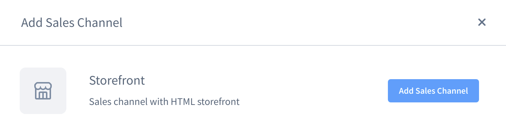
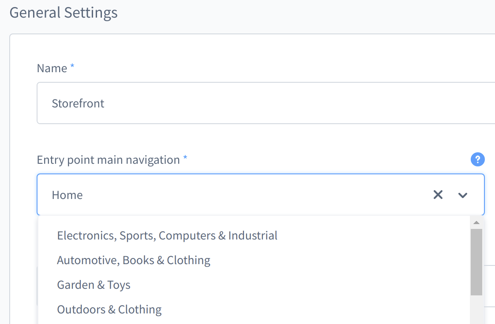
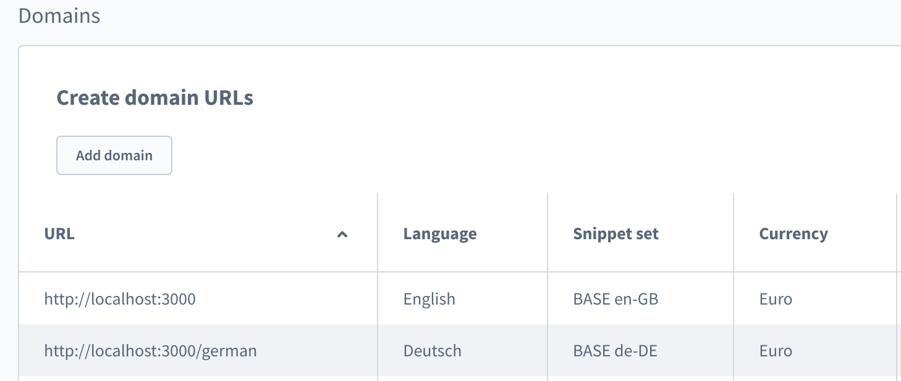
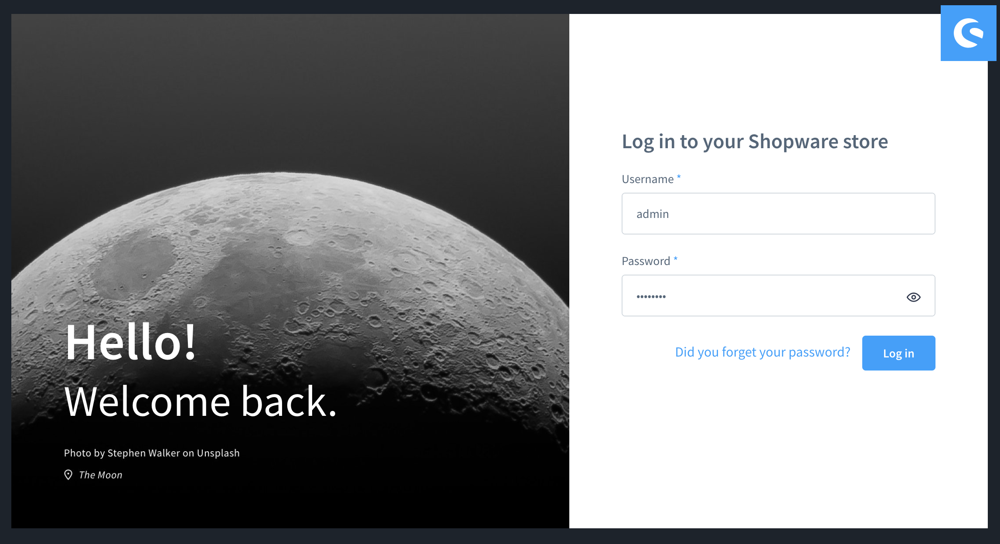
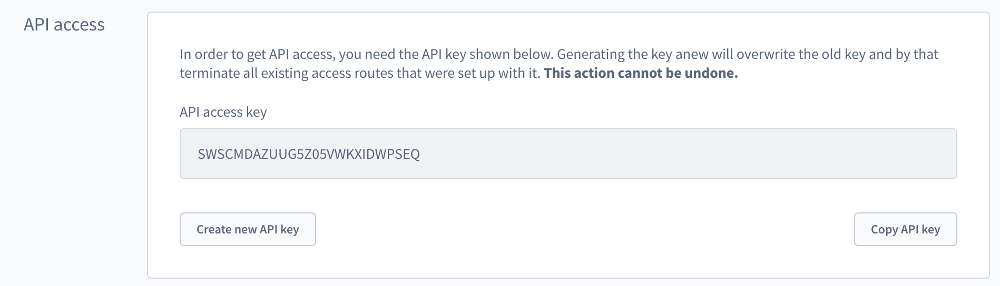

# Set up your Shopware 6 instance

::: tip
This whole guide is also available as a [video tutorial](https://www.youtube.com/watch?v=--jUufVubyE) on Youtube.

Some paths and namings might not be 100% up to date in the video, so be aware of that.
:::

In order to **make Shopware work with shopware-pwa** you have to follow a few simple steps.

## Table of contents

1. Shopware 6 instance (the most recent version, the better)
2. PWA plugin installed
   - 2.1. Check [Compatibility Table](#compatibility-table)
   - 2.2. [Install a plugin](#installation-of-pwa-plugin)
3. Sales Channel configured
   - 3.1. [Set up the Sales Channel](#set-up-a-sales-channel)
   - 3.2. [Get the API access key](#api-credentials)

## Compatibility Table

We want Shopware PWA to be in sync with the latest endpoints of Shopware, to be able to ship new features to you as soon as they are released within Shopware.

Here you may find a compatibility table for the Shopware API with corresponding PWA plugin.
| Shopware PWA version                                                                                                                        | Shopware 6 version                                                                                                                                                                                                                                                     |
| :------------------------------------------------------------------------------------------------------------------------------------------ | :--------------------------------------------------------------------------------------------------------------------------------------------------------------------------------------------------------------------------------------------------------------------- |
| [](https://github.com/vuestorefront/shopware-pwa/releases/tag/v1.3.0) | [](https://github.com/shopware/platform/releases/tag/v6.4.9.0) & [](https://github.com/elkmod/SwagShopwarePwa/releases/tag/v0.3.2) |
| [](https://github.com/vuestorefront/shopware-pwa/releases/tag/v0.8.2) | [](https://github.com/shopware/platform/releases/tag/v6.3.5.4) & [](https://github.com/elkmod/SwagShopwarePwa/releases/tag/v0.2.1) |

&nbsp;

Find more information on updating and versioning within our [Upgrade](/landing/operations/migrations) section

## Installation of PWA plugin

Make sure you've installed a compatible version of Shopware according to the compatibility table above.

Within your Shopware root directory run:

```bash
composer require shopware-pwa/shopware-pwa
```

This will download a shopware plugin named `SwagShopwarePwa`, adding some readonly endpoints required to allow for performant rendering of the PWA.

After that run

```
bin/console plugin:refresh && bin/console plugin:install --activate SwagShopwarePwa
```

This will install and activate your plugin.

Alternatively, you can download a plugin as a zip package and upload it directly via admin panel (since v6.4.x: Extensions > My extensions > Upload plugin). Then the plugin can be installed & activated at the extensions view.

Now your instance is ready to go.

## Set up a Sales Channel

Sales channel **must** follow few rules to become a PWA ready:

### Must have a **storefront** type

Thanks to this, the Shopware PWA will be a Shopware 6 routing aware (used for dynamic pages).



### Must have a main menu entrypoint selected

The main navigation is based on that option.



### Must have the **domains** section configured properly.

In general, the domain's URL should correspond to the real URL (domain) used for that specific Shopware PWA instance.
The URL of each domain will be used later on, during project configuration.



## API Credentials

When running the CLI init function `shopware-pwa init` or editing the `shopware-pwa.config.js` directly, you might be wondering where to get the access token from.

An access token is usually associated with a "Sales Channel". These are defined in you Shopware instance. Log in to your Shopware instance - by default it uses the `admin` and `shopware` credentials.



Once you are logged in, you can find the configured Sales Channels on the left side of your navigation bar.

Select the `Storefront` sales channel or any sales channel that you've configured manually and the scroll down to the `API access` section. Copy the API access key and you're good to continue with your PWA setup.



### Great! You've got everything you need.

[Continue with the PWA setup](/landing/getting-started/create-project)
