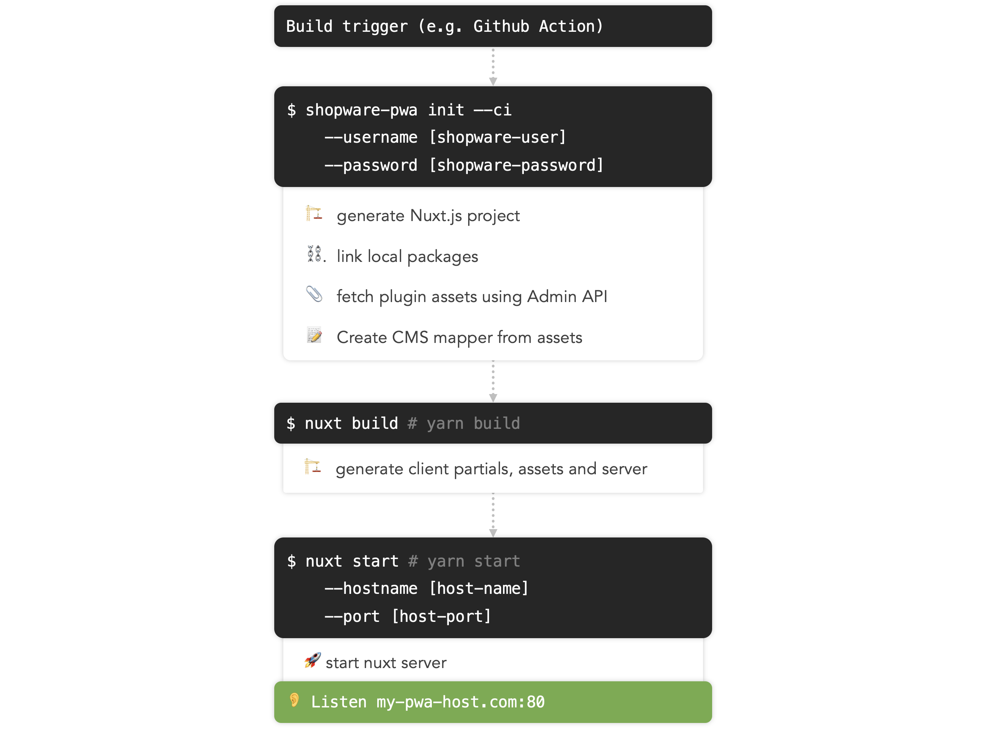

# Deployment

This section handles the process of bringing your application from source code to any server.

## Guides

Guides for specific hosting platforms with step-by-step instruction for your setup.

- Deploy on [Heroku](./heroku/)

## Build process

In order to build your custom deployment, it is more than helpful to understand the build process. The following diagram illustrates the process.



### Build trigger

Depending on your CI setup you will usually have a trigger that initiates a build, e.g. pushing to a certain branch. You can obviously also trigger the build automatically.

### Initialize the project

```
$ shopware-pwa init
    --ci
    --username [shopware-user]
    --password [shopware-password]
```

Let's take this one apart. We set the `--ci` parameter to deactivate the interactive mode where the CLI would ask us for the Shopware credentials. Instead, we just provide them using the `--username` and `--password` credentials. These credentials are used to request the currently installed plugins in your Shopware instance.

During CI, you're obviously not creating a new Nuxt project as the diagram above states. Instead, the CLI skips the initial setup, when there is a `nuxt.config.js` file in your project root.

All artifacts of that step are placed in the `.shopware-pwa` directory.

:::details 💡 Requests to Shopware during build process
If you want to restrict requests by the build server for your API, make sure to exclude these routes:

1. Obtain Admin API authentication token `/api/oauth/token`
2. Fetch plugin assets `/api/_action/pwa/dump-bundles`

Step 2. will return two file links, one will be a .zip file containing all the resources from your plugins, the other one will be a .json file containing your plugins configuration (as made in the admin interface). Make sure, that these files are accessible by your build server.
:::

### Build the project

```
$ yarn build
```

This command will let Nuxt.js generate the minified sources and assets of your application, such as

- Client application
- Application Server for SSR
- Code partials for pre-fetching

and place it in the `.nuxt` directory.

### Start the server

```
$ yarn start
```

Will start the application server. You can specify a specific host and port using the `--hostname` and `--port` parameters or using the environment variablbes `HOST` and `PORT` respectively.

Instead you can also set them in your `nuxt.config.js`

```js
export default {
  server: {
    port: 8000,
    host: "0.0.0.0",
  },
  /* more config */
};
```

## More on that

- [Nuxt.js Docs on Commands & Deployment](https://nuxtjs.org/guide/commands)
- [Prepare Shopware instance](https://shopware-pwa-docs.vuestorefront.io/landing/getting-started/prepare-shopware.html)
