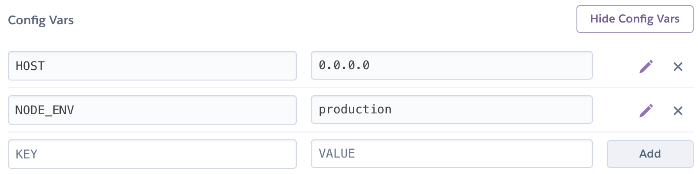

# Deploy on Heroku

To deploy your app to Heroku, you need to follow a few simple steps and you are ready to go.

This guide assumes you have

- [Heroku CLI](https://devcenter.heroku.com/articles/heroku-cli) installed and configured
- created a working local project with `npx @shopware-pwa/cli init`
- created a new application in your Heroku dashboard

## Heroku Setup

According to the Nuxt.js documentation on deploying to Heroku, you have to set two environment variables in your Heroku App. You can set those in your Applications' _Settings_ tab in the _Config Vars_ section:



Next, you have to add the Heroku git remote to your repository remotes. shopware-pwa cli already created a Git repository inside your project, so you just have to run

```bash
heroku git:remote -a my-pwa-project
```

where `my-pwa-project` is the name of your Heroku app.

## Node and package manager versions

Next, we have to define a node environment for our Heroku app. We can do that by adding an `engines` config to our `packages.json` file. For me, using the same versions that I use for local development worked just fine.

```json
{
  "name": "shopware-pwa-project",
  "version": "1.0.0",
  "engines": {
    "node": "12.x",
    "yarn": "1.22.x"
  },
  ...
}
```

You can alternatively use npm if you specify a npm version instead.

## Build command

Heroku automatically invokes our `build` script when we deploy, so we have to add the `npx @shopware-pwa/cli init` command to that step.

Replace your current `build` script inside your `package.json` with the following:

:::warning IMPORTANT
Make sure, the `@shopware-pwa/cli` version matches the version you've used to create your project, unless you are using `npx` command.
:::

```json
"scripts": {
  "build": "yarn shopware-pwa --ci && nuxt build",
  ...
```

This will build our application with shopware-pwa init in CI mode (so it doesn't ask for setup options) and then build the Nuxt application.

## Deploy

And that's it. You just have to commit your changes and push them to Heroku using

```bash
git push heroku master
```

Heroku will automatically invoke first the `build` step, and then the `start` step. You will see an output of that build process in your CLI.

```bash
remote: Compressing source files... done.
remote: Building source:
remote:
remote: -----> Node.js app detected

# ...
# this process will take about 2-3 minutes
# ...

remote: -----> Launching...
remote:        Released v7
remote:        https://my-pwa-project.herokuapp.com/ deployed to Heroku
remote:
remote: Verifying deploy... done.
To https://git.heroku.com/my-pwa-project.git
   afe0c97..0021a4b  master -> master
```

Now your app should be available on your public URL - like `https://my-pwa-project.herokuapp.com/`.

## Debugging

After your app was deployed, you can display your logs using:

```bash
heroku logs --tail -a my-pwa-project
```

**Common errors**

- Wrong or missing Node.js or Package manager version
- Wrong version of `shopware-pwa/cli` in you `build` command
- Not using the `HOST` or `PORT` variable in your `nuxt.config.js` configuration.

## Known issues

#### User Context Problem

Currenty the handling of the user context is broken, so logging in and using the Cart doesn't work on this deployment. We are working on the issue.

## Resources

- [How to deploy on Heroku by Nuxt.js](https://nuxtjs.org/faq/heroku-deployment/)
- [Heroku Node.js Support](https://devcenter.heroku.com/articles/nodejs-support)
