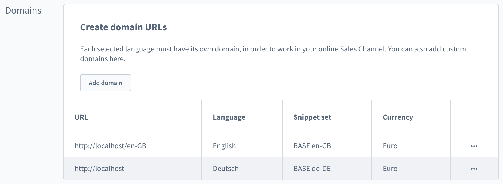

# Migrate version 0.6.x to 0.7.x

### Table of contents

- [Release Notes](#release-notes)
- [Migration steps](#migration-steps)

# Release Notes

For the next release, we're going to introduce two major improvements for the following parts of the application:

- Product variant handling
- Domain / Route handling

See the text below to find out about the details

## **Product variant handling**

In the existing implementation, we're fetching all `children` of a product for the product detail page. Each children is a full product has its corresponding `options` , and for that reason the response becomes increasingly bloated with redundant information and renders the API unusable for certain scenarios (500+ variants for one product). For that reason, we've been improving the way that products are fetched when displaying a detail page, so that we only query the single product that is displayed along with the potential configuration options, defined in a so-called `configurator` object. The new response is significantly more sparse and performant, both on the API side and on the frontend.

**Exclusions**

There was another misbehaviour related to variant exclusions. E.g. you have a product in two colours _blue, red_ and two sizes _small, large_. However, in that special case you don't offer the _red_ shirt in _large_. You would still be able to see the option, however when you tried to select it, the configuration would be invalid and the query would result in an error.

The handling was refactored in the following way

1. Try to fetch the product based on the configuration changes applied
2. If the configuration is not available, remove all options, but the one which was just changed and display the first entry from the resulting list of products.

**Changes**

In order to make sure your project remains compatible with these changes, please take a look at the changes in `packages/composables/src/logic/useProductConfigurator.ts` and `packages/default-theme/src/components/SwProductDetails.vue`. It also helps to look into the corresponding [pull request](https://github.com/vuestorefront/shopware-pwa/pull/1296).

## Domain / Route Handling

Shopware allows the configuration of multiple domains per sales channel. Each domain is associated with a corresponding pre-configuration of language, currency and snippet set. However, until now Shopware-PWA wasn't aware of those domains. Instead it was taking the **languages** configuration from the sales channel as a base for your language selection and implemented the routing based on the corresponding locales. This led to "hard-coded" language domains, like [https://shopware-pwa.storefrontcloud.io/de-DE/](https://shopware-pwa.storefrontcloud.io/de-DE/).

The new behaviour adapts the intended usage of domains and maps it to the routing of PWA. In short:

- You can configure domains (incl. currency, language) in your Shopware instance.
- When you re-build the application, shopware-pwa CLI will fetch that configuration
- Routing will work just as expected. e.g.:

/store/uk ⇒ Display british translation with Pound Sterling currency preselection
/store/pl ⇒ Display polish translation with Polish Zloty currency preselection
/ ⇒ Display default translation with default currency

Please test this new behaviour and, if necessary, adapt the domain configuration within Shopware, so that it matches your intended behavior. If you don't want to use the entire domain configuration of your sales channel (e.g. only some domains are used for PWA, others are still used for the storefront), you can change the configuration (as it was fetched through the API) within the `.shopware-pwa/sw-plugins/domains.json` file.

## Migration steps

In order to get aligned to the new routing logic you MUST make a couple of changes in the project.

### 1. Pages structure

There is no need to keep the old `_lang` structure, because the domains' related data (like locale code, language id and so on) is injected to each route during the building process, ts we don't need the `_lang` parameter before each page/route - it's handled automatically.

- Remove all the pages from `%PROJECT_DIR%/src/pages` except the `_lang/` sub-directory (keep it for the next step)
- Move the whole files structure from `%PROJECT_DIR%/src/pages/_lang` to the main pages directory to have them all in the folder above.
- update `_.vue` file - now located in `src/pages/_.vue`.
  The logic responsible for extracting a path from route was simplified and actually is no needed any longer.

```jsx
    let path = params.pathMatch // REMOVE IT
    const lang = params.lang // REMOVE IT
    if (lang && !languagesMap[lang]) { // REMOVE IT
      path = `${lang}/${params.pathMatch}` // REMOVE IT
    } // REMOVE IT

    const searchResult = await search(path, query) /* CHANGE INTO -> */ const searchResult = await search(params.pathMatch, query)
```

### 2. Fill in the `shopware-pwa.config.js` config file

Since now, few new parameters are available and required to tell the shopware-pwa what's fallback domain's prefix or what the shopware-pwa domain look like to be self domain aware in order to create proper routes.

- **pwaHost** (string as a valid hostname) - it's the domain you want to run the shopware-pwa on, for example: https://shopware-pwa.storefrontcloud.io or just [http://localhost](http://localhost). It is required to let the PWA strip out the host name from the domains configured in Shopware, so that it can work with relative paths.
- **fallbackDomain** (string starting with slash "/") - shopware-pwa looks for the matching domain from the configuration and from the current URL. If they don't match - it performs a redirect to the default one - fallback domain. For instance it would be `[https://localhost/us-US/bahamas](https://localhost/us-US/bahamas)` 404 → redirect `[https://localhost/default](https://localhost/default)` the `/default` would be a fallbackDomain value here. And It should also be contained in the domains settings in the Shopware 6 configuration panel.

### 3. Synchronize domains data

The source of all possible domains (the prefixes before the page's path) are kept in `.shopware-pwa/sw-plugins/domains.json` file. To have it in the project it's necessary to run `init` CLI command or use separate command.

- `npx @shopware-pwa/cli@canary init` ← executes the domains synchronization under the hood.
- `npx @shopware-pwa/cli@canary domains`

If the commands succeed - you will be noticed by the "Shopware domains refreshed" information.

### 3a. Edit language labels for language switcher

Since the entries from _domains.json_ are the source of available languages, coming right from admin panel - you may want to have a different label for each one.
In order to edit labels, you need to open a `.shopware-pwa/sw-plugins/domains.json` file and change the property `languageLabel` and put there whatever string you want.

**But I would like to keep my old domains / routes!**

That's not a problem - just configure them accordingly in the Shopware Admin Panel



### 4. Language switcher

The source of the available languages depends now on available domains data coming from `domains.json` from the previous step (3. synchronize domains data). This is why the list of available languages used by the switcher is now taken from `useDomains` composable - the `useLocales` is marked as deprecated. So there are places that require some adjustments.

- change `SwLanguageSwitcher.vue`

```jsx
// changes in template section
<div
  - v-if="availableLanguages.length > 1"
  + v-if="availableDomains.length > 1"
    class="sw-language-switcher"
    data-cy="language-switcher"
  >
    <SfSelect
		- :selected="currentLocale"
    + :selected="currentDomainId"
		- :size="availableLanguages.length"
    + :size="availableDomains.length"
      class="sw-language-switcher__select sf-select--no-chevron"
      data-cy="language-switcher-select"
		- @change="changeLocale"
    + @change="changeDomain"
    >
      <SfSelectOption
      - v-for="language in availableLanguages"
      - :key="language.code"
      - :value="language.code"
			-	v-for="language in availableDomains"
			- >{{ language.name }}</SfSelectOption
      + v-for="domain in availableDomains"
      + :key="domain.domainId"
      + :value="domain.domainId"
      + data-cy="language-switcher-option"
      + >{{ domain.languageName }}</SfSelectOption
      >
    </SfSelect>
 </div>

// changes in script block
- import { useLocales } from "@/logic/useLocales"
+ import { useDomains } from "@/logic/useDomains"

// changes in setup method
- const { availableLanguages, currentLocale, changeLocale } = useLocales(root)
+ const { availableDomains, currentDomainId, changeDomain } = useDomains(root)

return {
			- availableLanguages,
      + availableDomains,
			- currentLocale,
      + currentDomainId,
			- changeLocale,
      + changeDomain,
}
```

- change `SwBottomMoreActions.vue` (for mobile menu)
  Follow the changing flow from the step above (`SwLanguageSwitcher.vue`) - it's very similar.

### 5. Components

The last crucial change affects the route generation mechanism. Now the $routing nuxt plugin is being used to get URL for current domain.

- replace all occurrences of `$i18n.path` in the project with `$routing.getUrl`

```jsx
- <nuxt-link aria-label="Go to Home Page" :to="$i18n.path('/')">
+ <nuxt-link aria-label="Go to Home Page" :to="$routing.getUrl('/')">
```

The new helper takes always the current domain's prefix and put it first before the route's path.
