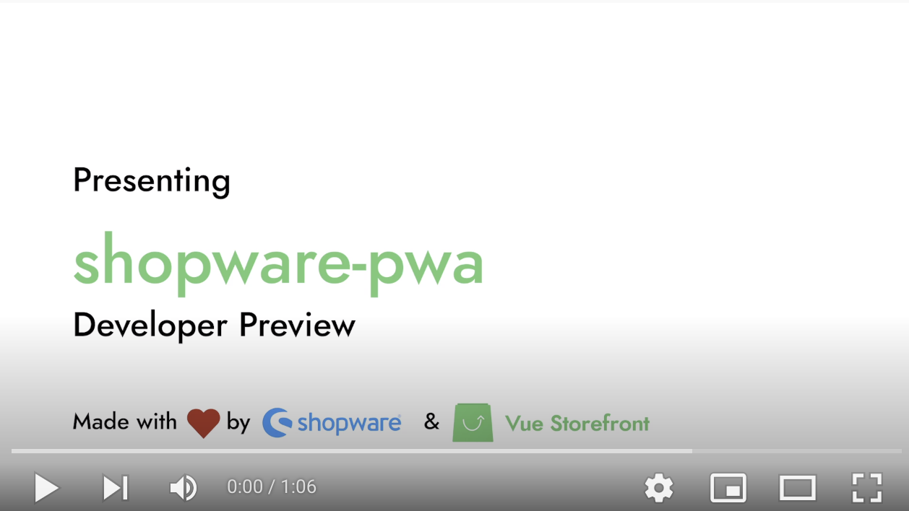
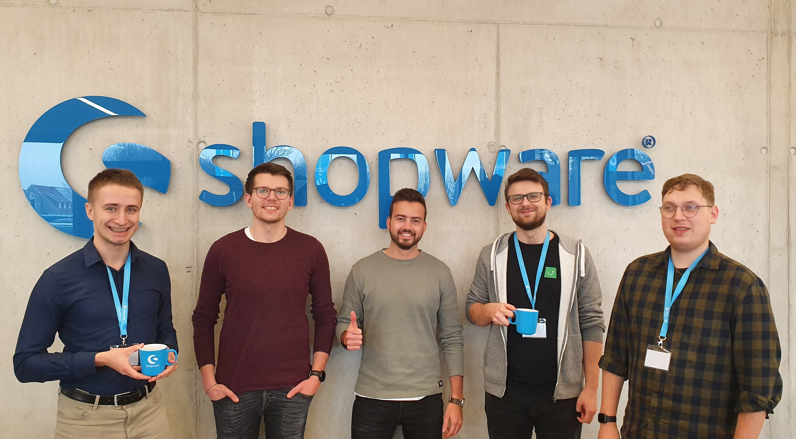

# Project

## Video demo

Shopware PWA is a project created in a cooperation between [Vue Storefront](https://www.vuestorefront.io/) and [shopware AG](https://shopware.com/) in order to deliver a state-of-the-art customisable frontend for Shopware 6.

It takes the capabilities of Shopware 6 and brings it to the hands of the frontend developers to create outstanding customer experiences based on modern frontend technologies like:

- Vue.js
- Nuxt.js
- Typescript
- Jest
- and many more

Many of the Shopware Core concepts you are used to will be available as well, including:

- Shopping Experiences (CMS)
- Search and filters
- Product variants
- Checkout and payment
- User self-management
- Plugin system

If you have a specific set of features, feel free to compare it against our curated and regularly updated [Feature List](/landing/resources/features)

## Why a new storefront?

Good question - Shopware already comes with a storefront. However, it is a headless commerce platform which means that it has no "native" frontend to it. So even the **default** Storefront is just **one** frontend that can be used.

We are observing a paradigm shift that lets more and more projects and customers transition into more universal frontend applications based on JavaScript. They have the great benefit to integrate easily with other services like CMS, personalisation engines or search by sharing code on both front- and backend.

The full frontend stack can be JavaScript based and, depending on your requirements, use features like SEO-friendly server-side rendering, smart pre-compilation or reactive elements and PWA. It can also provide fully static pages if you wish so.

This new generation of frontend applications is also often referred to as _JAMstack_ (short for JavaScript, API and Markup) as coined by frameworks like (Next.js and Gatsby).

<!-- Great chance for another article to elaborate on why PMs / SIs would opt for PWA instead of default storefront -->

## Who is maintaining the project?

The project is maintained by a shared core team of Shopware and Vue Storefront experts. The roadmap is obviously closely coupled to the roadmap of the Shopware platform core, but contributions and specific community wishes are just as important to us.

All core maintainers of the project are active and approachable in our discord channel.

If you have any questions or ideas feel free to [join our discord](https://discord.vuestorefront.io).

## How can I contribute?

We are excited for every open source contributor to our project. Issue reportings, bugfixes, feature requests, code reviews, pull requests - every type of contribution is more than appreciated. Don't hesitate to ask or raise an issue if you've got a question or anything feels odd to you.

Go ahead and read our [Contribution Guide](./contribution) to find out more.
