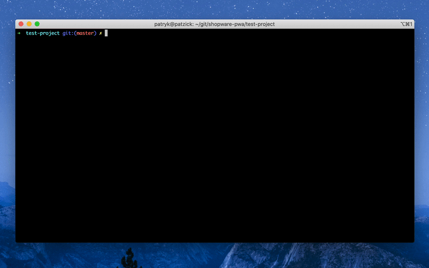

# FAQ & Troubleshooting

## Issues caused by incorrect configuration.

### Issue: [ERROR] Problem with fetching CMS data: ` Path `` could no be resolved. `

- Make sure you have followed the instructions in our [Cheatsheet](./cheatsheet.html), especially [Shopware setup](./cheatsheet.html#shopware-setup).\*
- Ensure you have configured `shopware-pwa` application by setting the right values described in [this step](./cheatsheet.html#running-shopware-pwa-on-custom-shopware-instance).
  It's crucial to have the right `shopwareAccessToken` in the _shopware-pwa.config.js_ file. \
  It should be taken from **`storefront`** Sales Channel type - **NOT** a `headless` one.

### Issue: [ERROR] Problem with fetch <ENTITY_NAME> data: `No Matching sales channel found.`

- There is no Sales Channel related to the `shopwareAccessToken` you have set in your _shopware-pwa.config.js_ file.
- Either `shopwareEndpoint` or `shopwareAccessToken` does not match.
- Use the appropriate endpoint and access token (from Shopware admin panel) and follow steps described [here](./cheatsheet.html#running-shopware-pwa-on-custom-shopware-instance) ("Running Shopware PWA on custom Shopware instance" chapter).

### Issue: There are no products in the product listing. \*

- In your Shopware platform: Assign the categories and the products to the right Sales Channel, related to the `shopwareAccessToken` you have set in _shopware-pwa.config.js_.

- It might be, that your local PWA version is out of date.
  Try to use the `npx @shopware-pwa/cli` command instead to have always latest version of the package.

---

`*` - if you are using your self-hosted Shopware instance

### Question: How can I override theme component?

You can override theme component easily by typing `yarn shopware-pwa override` and picking component to override.
:::warning
Please remember, that overriding component means you no longer use theme component so you'll have no updates for overrided components. If you feel that you need to override couple of components to accomplish some effect maybe we can help you upgrading theme to allow you to override just one component to have this. Feel free to ask your questions on discord or create an issue for that.
:::

Here's how overriding component looks like:


### Issue: Console warning - Trying to access Application context without Vue instance context.

Example:

It means that somewhere you have useAddToCart invocation without passing root. Find that in your code and add context.

See: [Context-awareness](/landing/fundamentals/security.html#context-awareness) section. It's explained in details.

### Issue: Console warning - [shopware-6-api] After calling API method XXXXXX there is no "onConfigChange" listener.

You should check all your imports for @shopware-pwa/shopware-6-client and add apiInstance as the last parameter.

See: [Context-awareness](/landing/fundamentals/security.html#context-awareness) section. It's explained in details.

### Issue: The API Client's timeout is too low. I'm getting HTTP 408 errors.

- Edit _shopware-pwa.config.js_ file
- Add entry:

```js
shopwareApiClient: {
  timeout: 10000; // 10 seconds of axios timeout setting
}
```

### Issue: There is no language available in language switcher

::: tip
Learn [the details](../cookbook/#how-to-add-another-language) how to set the new language properly.
:::

- Check if there are entries in `.shopware-pwa/sw-plugins/domains.json`.
- If not, run `yarn shopware-pwa domains` command.

### Issue: There's no "thank you page" on Apple devices

- The issue is described broadly [here](https://github.com/vuestorefront/shopware-pwa/issues/1638).
- The possible solution in your project may look like in the [PR](https://github.com/vuestorefront/shopware-pwa/pull/1644):
  - copy `api-client.js` plugin from (`%PROJECT_DIR%/node_modules/@shopware-pwa/nuxt-module/plugins/api-client.js`), do the changes from mentioned PR and put it in your project's `src/plugins` folder (you will lose the compatibility on further upgrades)
  - adjust every `handlePayment` usages to pass the context token parameter as a part of success/failure URL.
